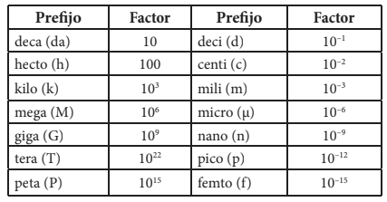
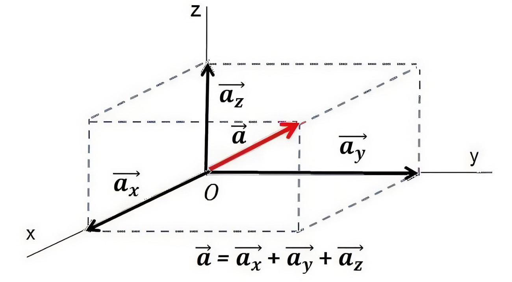
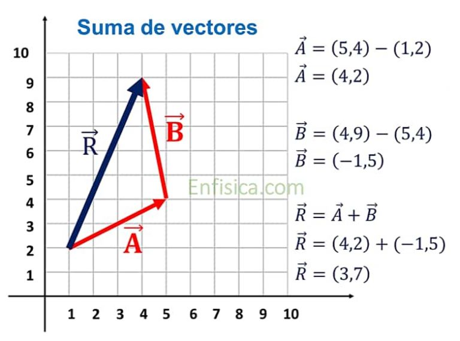

<html lang="es">
<head>
  <meta charset="UTF-8">
  <title>Semana 1 - Jueves Ago 14</title>
  
</head>
<body style="display: flex; margin: 0; min-height: 100vh;">
  <nav style="width: 240px; background: #f4f4f4; padding: 2em 1.2em 2em 1.2em; min-height: 100vh; box-shadow: 2px 0 8px #e0e7ef; border-right: 1px solid #e0e7ef; position: fixed; top: 0; left: 0; height: 100vh; overflow-y: auto; z-index: 1000;">
    <h2 style="font-size: 1.2em; color: #1a365d; margin-top: 0; margin-bottom: 1.2em; letter-spacing: 0.5px;">Temario</h2>
    <ul style="list-style: none; padding: 0; margin-bottom: 1.5em;">
      <li><a href="#magnitudes">Magnitudes físicas, análisis dimensional y sistemas de unidades</a></li>
      <li><a href="#vectores">Representación espacial y vectores</a></li>
    <li><a href="#tamano-forma">Tamaño y forma</a></li>
      <li><a href="#escala">Factores de escala</a></li>
    </ul>
    

    <h2 style="font-size: 1.2em; color: #1a365d; margin-top: 0; margin-bottom: 1.2em; letter-spacing: 0.5px;">Recursos</h2>
    <ul style="list-style: none; padding: 0; margin-bottom: 1.5em;">
      <li><a href="https://drive.google.com/file/d/19sQmagrnOjoRbrLMxakj8j26q0wYDHjf/view?usp=sharing">Análisis dimensional</a></li>
    </ul>
    

    <h2 style="font-size: 1.2em; color: #1a365d; margin-top: 0; margin-bottom: 1.2em; letter-spacing: 0.5px;">Autores</h2>
    <ul style="list-style: none; padding: 0; margin-bottom: 1.5em;">
      <li><a href="https://www.researchgate.net/profile/Hoover-Pantoja-Sanchez">Hoover Pantoja-Sánchez</a></li>
      <li><a href="https://www.researchgate.net/profile/Marco-Giraldo">Marco A.Giraldo</a></li>
    </ul>
    <a href="../" style="font-size:1em; color:#1a365d; background:none; border:none; text-decoration:underline;">&#8592; Volver al cronograma</a>
  </nav>
  <main style="flex: 1; padding: 2.5em 3em; background: #fff; min-height: 100vh; margin-left: 240px;">
    <h1 class="titulo-principal">Semana 2 (Jueves Ago 14)</h1>
    <section id="generalidades">
      <h1 class="titulo-principal">Generalidades de la biofísica</h1>
      

        
Aunque los procesos biológicos son bastante complejos, al final, se encuentran gobernados por las mismas leyes físicas que gobiernan sistemas más simples. En otras palabras los fenómenos físicos se convierten en la base sobre la cual se estructura la realidad en la que habitan los organismos biológicos. Por lo tanto, entender la relación entre los procesos biológicos y los fenómenos físicos subyacentes, es un paso crucial para aproximarse a la ecología. Para comprender esta relación, se requiere interiorizar conceptos que permitan a la física y la biología "hablar un mismo lenguaje". Al final, este rol lo cumple el lenguaje matemático.<strong>En esta sesión discutiremos conceptos básicos o fundamentales que permitirán adentrarse en temas físicos dentro de un contexto ecológico.</strong>

        <a href="https://drive.google.com/file/d/1LXqpWhVRihNQVxRNapYJI4FAxwwwvBCk/view?usp=sharing" target="_blank" style="display:block;margin:1em 0;font-weight:bold;color:#2563eb;">🎧 Escucha el podcast: Física y vida: conceptos básicos y la ley de escala</a>
      

    </section>
    <section id="magnitudes">
      <h2 class="subtitulo" id="magnitudes">Magnitudes físicas, análisis dimensional y sistemas de unidades</h2>
      
Una <strong>magnitud física</strong> se refiere a cualquier propiedad de un objeto o fenómeno que puede ser expresada numéricamente, como: la distancia, el tiempo, la masa o la temperatura. La <strong>cantidad</strong>, por su parte, se refiere a la medida de una magnitud física, expresada en un sistema de unidades específico como: metros, segundos, gramos y °C.

      
Se reconocen <strong>cuatro cantidades fundamentales</strong> la longitud (L) con dimensión [L], la masa (M) cuya dimensión es [M], el tiempo (t) cuya dimensión es [T] y la carga eléctrica (C) cuya dimensión es [C]. Desde aquí expresaremos la dimensión de una cantidad física encerrandola entre corchetes. Por ejemplo, si T es una temperatura, su dimensión se expresaría [T].

      
Cualquier otra cantidad física se expresa a partir de las cantidades fundamentales. Por ejemplo el área (A) con dimensión [A]=L2, o la densidad (&rho;) con dimensión [&rho;]=ML-3.

      
Existen 3 sistemas de unidades para expresar las cantidades físicas de manera coherente: El <strong>Sistema Internacional (SI)</strong>, el <strong>Sistema Gaussiano</strong> y el <strong>Sistema Ingles (SU)</strong>. Los factores de conversión, entre los sistemas
      de unidades SI y gaussiano, están dados por  1m=102cm y 1kg=103g.  El sistema de unidades SU no es común en contextos científicos. En este sistema las cantidades fundamentales son la fuerza con dimensión F, la longitud con dimensión L y el tiempo con dimensión T y sus unidades patrón son, respectivamente, la libra (lb), el pié (p) y el segundo (s).

      <figure style="text-align:center; margin:2em 0;">
        
        <figcaption style="color:#2563eb; font-size:1em; margin-top:0.5em;">Tabla 1: Ejemplo de unidades físicas. Las unidades de fuerza que se llaman Newton (N), a las de trabajo y energía Julio (J), potencia Vatio (W) y presión Pascal (Pa)</figcaption>
      </figure>
      <figure style="text-align:center; margin:2em 0;">
        
        <figcaption style="color:#2563eb; font-size:1em; margin-top:0.5em;">Tabla 2: Múltiplos y submúltiplos de las unidades del SI</figcaption>
      </figure>
          

            

              <iframe src="https://www.youtube.com/embed/eBML4oHcUXQ?si=TByBOrhgT31Rt7YL" title="Importancia del análisis dimensional" allowfullscreen></iframe>
              <figcaption style="color:#2563eb; font-size:1em; margin-top:0.5em;">Video 1. No seas un pend#$%#$%: la importancia del análisis dimensional para hablar de física</figcaption>
            

            

              <iframe src="https://www.youtube.com/embed/87pGTT68izY?si=R4-DMAYCatFUFrnG" title="Video adicional" allowfullscreen></iframe>
              <figcaption style="color:#2563eb; font-size:1em; margin-top:0.5em;">Video 2. Por qué es tan peligroso ver estas pendej"#$$"#$</figcaption>
            

          

    </section>
    <section id="vectores">
        <h2 class="subtitulo" id="vectores">Representación espacial y vectores</h2>
        
Para poder representar los fenómenos físicos reales, las cantidades físicas necesitan incluir la dirección en la que se presenta la propiedad. Un avión, por ejemplo, se desplaza con una velocidad que tiene una dirección específica. Para incluir la dirección como una propieddad de la cantidad, la física diferencia entre cantidades escalares o vectoriales. Una <strong>cantidad escalar</strong> se refiere a cualquier propiedad de un objeto o fenómeno que puede ser expresada numéricamente, como: el área (A), el tiempo (t), la masa (m) o la temperatura (T). La <strong>cantidad vectorial</strong>, son las que requieren añadir una dirección además de su magnitud, como la velocidad (v), la aceleración (a), la velocidad angular (w), la aceleración angular (&alpha;), el momento lineal (p), la fuerza (F), el torque (&tau;), el momento angular (L), etc.

        
Los vectores se pueden representar mediante la suma de sus proyecciones rectangulares (Figura 1). Así, los vectores tienen una magnitud (|r|) y una dirección (dir(r)). Para sumar dos o más vectores, se requiere sumar sus direcciones y su magnitud(Figura 2).

        
Una propiedad física, como la velocidad, se puede representar a partir de vectores (Figura 3). En este caso, la velocidad se representa cómo el cambio &mdash; de aquí en adelante representado por la letra delta mayúscula &Delta; &mdash; de la posición o desplazamiento (&Delta;r), en relación al cambio del tiempo (&Delta;t) &mdash; como podemos ver, en este caso el tiempo lo definimos como un escalar y no un vector, porque el tiempo no tiene una dirección. El desplazamiento,en este ejemplo, tiene una magnitud (|&Delta;r|) y una dirección (dir(&Delta;r)). A la magnitud de la velocidad, la llamamos rapidez y la podemos expresar en el sistema internacional como m/s.

        <figure style="text-align:center; margin:2em 0;">
          
          <figcaption style="color:#2563eb; font-size:1em; margin-top:0.5em;">Figura 1: Componentes rectangulares de un vector. El vector a se expresa como la suma de sus sus componentes rectangulares a = ax + ay + az. </figcaption>
        </figure>
        <figure style="text-align:center; margin:2em 0;">
          
          <figcaption style="color:#2563eb; font-size:1em; margin-top:0.5em;">Figura 2: Suma de vectores.</figcaption>
        </figure>
        <figure style="text-align:center; margin:2em 0;">
          
          <figcaption style="color:#2563eb; font-size:1em; margin-top:0.5em;">Figura 3: Aplicación de vectores a la física.</figcaption>
        </figure>
    </section>
    <section id="tamano-forma">
      <h3 class="subtitulo">Tamaño y forma</h3>
      
Una propiedad física que es muy importante en los procesos biológicos es el tamaño y la forma. La enorme diversidad de formas y tamaños en los seres vivos, determinan la estructura, función y supervivencia de un organismo, ya que estám intimamente afectados por fenómenos físicos que veremos más adelante, como: la gravedad, la difusión, el transporte de calor, las propiedades elásticas de los materiales, la dinámica del movimiento o la tensión superficial.

      <ul>
        <li><strong>No Extrapolación Simple:</strong> No es posible simplemente extrapolar las funciones vitales de un organismo si sus dimensiones cambian, ya que su configuración corporal, metabolismo, reproducción y otras funciones vitales se modifican profundamente con el tamaño.</li>
        <li><strong>Forma y Tamaño Interrelacionados:</strong> La forma es, con frecuencia, una función del tamaño. Por ejemplo, las patas de una ardilla y una vaca no pueden tener la misma estructura debido a sus masas distintas. Un exoesqueleto es eficaz para animales pequeños, pero inviable para los grandes, que necesitan un endoesqueleto. La difusión directa de oxígeno es suficiente para una ameba, pero organismos grandes y complejos requieren un sistema circulatorio.</li>
        <li><strong>Discontinuidades Evolutivas:</strong> Hay formas que son posibles para un tamaño determinado, pero inviables para otros, lo que ha llevado a discontinuidades en el diseño de los organismos, forzándolos a cambiar evolutivamente forma y tamaño de manera conjunta para ser viables.</li>
        <li><strong>Evolución del Tamaño:</strong> Históricamente, los organismos grandes aparecieron tardíamente. Se observa una tendencia al aumento en las dimensiones de los seres vivos más grandes a lo largo de la historia. Este crecimiento en volumen se logra aumentando el número y la variedad de células, no el tamaño individual de estas. El aumento de tamaño exige, y a la vez posibilita, una mayor complejidad y especialización celular.</li>
        <li><strong>Ventajas y Desventajas del Tamaño:</strong> Ser grande puede ofrecer ventajas competitivas (ej. árboles altos para captar luz solar), pero también inconvenientes en entornos cambiantes, ya que requiere un consumo continuo de grandes cantidades de recursos. Los organismos más pequeños (microorganismos, artrópodos, mamíferos primitivos) han demostrado mayor supervivencia en extinciones masivas.</li>
        <li><strong>Límites de Tamaño:</strong> Existe un límite inferior (tamaño de moléculas complejas, virus, micoplasmas, que requieren interacciones de muchas moléculas para la autonomía) y un límite superior. El animal terrestre más pesado conocido fue el Baluchitherium (~30 toneladas), mientras que la ballena azul supera las 100 toneladas, beneficiándose de la sustentación en el agua. Las secuoyas gigantes pueden superar las 10 veces la masa de una ballena azul, pero gran parte es tejido muerto. La diferencia de masa entre un micoplasma y una ballena azul abarca 21 órdenes de magnitud.</li>
      </ul>
      

            

              <iframe src="https://www.youtube.com/embed/vB68awp37Us?si=Sjpu2C-L1CjYcoxw" title="Comparación de tamaño" allowfullscreen></iframe>
              <figcaption style="color:#2563eb; font-size:1em; margin-top:0.5em;">Video 3. Comparación del tamaño y forma entre organismos</figcaption>
            

          

    </section>
  <section id="leyes-escala">
    <h3 class="subtitulo">Leyes de escala</h3>
    
Las leyes de escala, o relaciones de escala, se definen como la expresión de los cambios funcionales y estructurales que tienen lugar como consecuencia de los cambios de tamaño (cambios de escala) en los organismos. Aunque se suele pensar que al cambiar la escala de un sistema se mantienen las proporciones entre sus partes, esto no es así, incluso en sistemas sencillos, como una cuerda que eventualmente se romperá por su propio peso si aumenta de tamaño manteniendo sus proporciones. Los seres vivos deben ajustar su organización interna si su tamaño aumenta o disminuye para seguir siendo viables, lo que ha llevado a discontinuidades evolutivas en el diseño de los organismos.

    
Se distinguen dos tipos principales de relaciones de escala:

    <h4 style="color:#2563eb; margin-top:1em;">Relaciones isométricas o semejanza geométrica</h4>
      
Un cuerpo es isométrico a otro si mantiene las mismas proporciones al cambiar de tamaño. Esto significa que, si las dimensiones lineales (longitud, altura, anchura) de un cuerpo aumentan en un factor <strong>k</strong>, las relaciones entre todas sus dimensiones lineales se mantienen constantes.

      <ul>
        <li>Relaciones fundamentales:
          <ul>
            <li>La longitud (<strong>L</strong>) escala linealmente: <strong>L &propto; k</strong>.</li>
            <li>La superficie (<strong>S</strong>) escala con el cuadrado de la longitud: <strong>S &propto; L2 &propto; k2</strong>.</li>
            <li>El volumen (<strong>V</strong>) escala con el cubo de la longitud: <strong>V &propto; L3 &propto; k3</strong>.</li>
            <li>Si la densidad del organismo es constante (aproximadamente la del agua para los animales), la masa (<strong>M</strong>) también escala con el cubo de la longitud: <strong>M &propto; L3</strong>.</li>
            <li>De esto se deduce que la superficie es proporcional al volumen (o masa) elevado a la potencia de 2/3: <strong>S &propto; V2/3</strong> o <strong>S &propto; M2/3</strong>.</li>
          </ul>
        </li>
        <li>Ejemplos en seres vivos:
          <ul>
            <li>Humanos: La longitud de los brazos es proporcional a la altura total para mayores de 7 años, con una pendiente de 1 en un gráfico logarítmico, indicando isometría. En edades más tempranas, esta relación se rompe, reflejando cambios en la forma corporal.</li>
            <li>Fuerza muscular: La fuerza muscular es proporcional a la sección transversal de los músculos (una superficie). Para organismos isométricos, la fuerza muscular debería ser proporcional a la masa a la potencia de 2/3 (<strong>Fmusc &propto; M^{2/3}</strong>), lo cual se verifica con los récords mundiales de halterofilia en función de la masa corporal de los atletas.</li>
            <li>Longitud de los miembros: En animales isométricos, la longitud de los miembros (o segmentos) es proporcional a <strong>M^{1/3}</strong>, como se observa en segmentos de patas de cucarachas.</li>
            <li>Mohos del fango: Son organismos diminutos que mantienen las mismas proporciones independientemente de su tamaño, comportándose isométricamente, lo que sugiere que las cargas que soportan no son significativas.</li>
          </ul>
        </li>
      </ul>
    <h4 style="color:#2563eb; margin-top:1em;">Relaciones de escala alométricas</h4>
      
Las relaciones alométricas son expresiones que relacionan parámetros característicos de los organismos con un exponente diferente al de la semejanza geométrica, incluso cuando los cuerpos no son estrictamente semejantes. Se expresan generalmente como <strong>y = y0 x^a</strong>, donde <strong>y</strong> es un parámetro, <strong>x</strong> suele ser la masa corporal (<strong>M</strong>), <strong>y0</strong> es una constante que depende de la especie o grupo, y <strong>a</strong> es el exponente alométrico.

      <ul>
        <li>Representación gráfica: Al igual que las isométricas, se representan como líneas rectas en diagramas logarítmicos, donde la pendiente de la recta es el exponente <strong>a</strong>.</li>
        <li>Significado y relevancia: Son de interés si el exponente <strong>a</strong> es constante para un rango amplio de masas o un grupo grande de organismos, o si las discontinuidades en <strong>a</strong> revelan cambios cualitativos en la organización del ser vivo. Su interpretación ayuda a comprender la influencia de las leyes físicas y del entorno en la organización biológica.</li>
        <li>Valores de los exponentes y ejemplos:
          <ul>
            <li>Exponente negativo (<strong>a &lt; 0</strong>): El parámetro disminuye con la masa corporal. Ejemplo: el ritmo cardíaco de un animal (<strong>a &asymp; -0.25</strong>). La frecuencia respiratoria (<strong>M^{-0.26}</strong>) y la tasa metabólica específica (<strong>M^{-0.25}</strong>) también disminuyen con la masa. El coste energético por unidad de masa y distancia en la locomoción terrestre escala como <strong>M^{-0.33}</strong>.</li>
            <li>Exponente cero (<strong>a = 0</strong>): El parámetro no depende de la masa. Ejemplos: la masa de hemoglobina por unidad de volumen de sangre, o el tamaño de la mayoría de las células. La presión arterial y la velocidad de la sangre en la aorta también muestran exponentes cercanos a 0.</li>
            <li>Exponente positivo y menor que uno (<strong>0 &lt; a &lt; 1</strong>): Aumenta con la masa, pero a un ritmo menor que proporcional.
              <ul>
                <li>Superficie corporal: <strong>S &propto; M^{0.67}</strong>.</li>
                <li>Ritmo metabólico (Ley de Kleiber): La tasa metabólica en reposo (<strong>P_B</strong>) escala como <strong>M^{0.75}</strong>. Esta es una ley fundamental en biología, cuya universalidad sugiere principios básicos comunes a todos los seres vivos.</li>
                <li>Masa del cerebro: Escala como <strong>M^{0.67}</strong> en mamíferos, similar a la superficie corporal. Aunque la constante de proporcionalidad varía entre grupos (humanos vs. monos, reptiles), el exponente es universal, sugiriendo mecanismos comunes para adaptar el tamaño del cerebro a la escala corporal.</li>
                <li>Tasa metabólica máxima: (<strong>P_{máx} &propto; M^{0.81}</strong> o <strong>M^{0.85}</strong>).</li>
                <li>Tiempos biológicos: El "tiempo fisiológico" (gestación, vida media, etc.) suele ser proporcional a <strong>M^{0.25}</strong>. La vida media en mamíferos y aves escala con exponentes cercanos a <strong>M^{0.20}</strong> y <strong>M^{0.19}</strong> respectivamente.</li>
              </ul>
            </li>
            <li>Exponente uno (<strong>a = 1</strong>): El parámetro es estrictamente proporcional a la masa. Ejemplos: la masa del corazón o el volumen de la sangre en mamíferos, que son una fracción fija de la masa corporal.</li>
            <li>Exponente mayor que uno (<strong>a &gt; 1</strong>): El parámetro aumenta más rápidamente que la masa. Ejemplo: el peso del esqueleto en mamíferos, con un exponente de 1.09 (<strong>M_{esq} &asymp; 0.09 M^{1.09}</strong>). En aves, es <strong>M^{1.07}</strong>.</li>
          </ul>
        </li>
      </ul>
  </section>
  </main>
</body>
</html>
