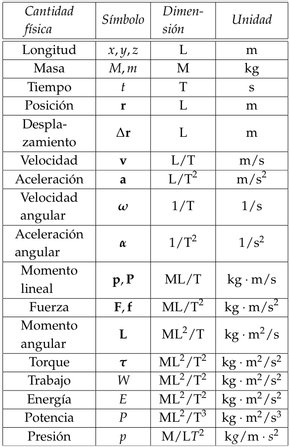

<!DOCTYPE html>
<html lang="es">
<head>
  <meta charset="UTF-8">
  <title>Semana 1 - Jueves Ago 14</title>
  
</head>
<body style="display: flex; margin: 0; min-height: 100vh;">
  <nav style="width: 240px; background: #f4f4f4; padding: 2em 1.2em 2em 1.2em; min-height: 100vh; box-shadow: 2px 0 8px #e0e7ef; border-right: 1px solid #e0e7ef; position: fixed; top: 0; left: 0; height: 100vh; overflow-y: auto; z-index: 1000;">
    <h2 style="font-size: 1.2em; color: #1a365d; margin-top: 0; margin-bottom: 1.2em; letter-spacing: 0.5px;">Temario</h2>
    <ul style="list-style: none; padding: 0; margin-bottom: 1.5em;">
      <li><a href="#magnitudes">Magnitudes físicas, análisis dimensional y sistemas de unidades</a></li>
      <li><a href="#vectores">Vectores</a></li>
      <li><a href="#conversion">Conversión de unidades y análisis dimensional</a></li>
      <li><a href="#grafico">Elaboración de gráficos y vectores</a></li>
      <li><a href="#alometria">Alometría y ley de Kleiber</a></li>
      <li><a href="#escala">Factores de escala</a></li>
    </ul>
    

    <a href="../" style="font-size:1em; color:#1a365d; background:none; border:none; text-decoration:underline;">&#8592; Volver al cronograma</a>
  </nav>
  <main style="flex: 1; padding: 2.5em 3em; background: #fff; min-height: 100vh; margin-left: 240px;">
    <h1 class="titulo-principal">Semana 2 (Jueves Ago 14)</h1>
    <section id="generalidades">
      <h1 class="titulo-principal">Generalidades de la biofísica</h1>
      

        
Aunque los procesos biológicos son bastante complejos, al final, se encuentran gobernados por las mismas leyes físicas que gobiernan sistemas más simples. En otras palabras los fenómenos físicos se convierten en la base sobre la cual se estructura la realidad en la que habitan los organismos biológicos. Por lo tanto, entender la relación entre los procesos biológicos y los fenómenos físicos subyacentes, es un paso crucial para aproximarse a la ecología. Para comprender esta relación, se requiere interiorizar conceptos que permitan a la física y la biología "hablar un mismo lenguaje". Al final, este rol lo cumple el lenguaje matemático.<strong>En esta sesión discutiremos conceptos básicos o fundamentales que permitirán adentrarse en temas físicos dentro de un contexto ecológico.</strong>

        <a href="https://drive.google.com/file/d/1LXqpWhVRihNQVxRNapYJI4FAxwwwvBCk/view?usp=sharing" target="_blank" style="display:block;margin:1em 0;font-weight:bold;color:#2563eb;">🎧 Escucha el podcast: Física y vida: conceptos básicos y la ley de escala</a>
      

    </section>
    <section id="magnitudes">
      <h2 class="subtitulo" id="magnitudes">Magnitudes físicas, análisis dimensional y sistemas de unidades</h2>
      
Una <strong>magnitud física</strong> se refiere a cualquier propiedad de un objeto o fenómeno que puede ser expresada numéricamente, como: la distancia, el tiempo, la masa o la temperatura. La <strong>cantidad</strong>, por su parte, se refiere a la medida de una magnitud física, expresada en un sistema de unidades específico como: metros, segundos, gramos y °C.

      
Se reconocen <strong>cuatro cantidades fundamentales</strong> la longitud con dimensión L, la masa cuya dimensión es M, el tiempo cuya dimensión es T y la carga eléctrica cuya dimensión es C. Desde aquí expresaremos la dimensión de una cantidad física encerrandola entre corchetes. Por ejemplo, si T es una temperatura, su dimensión se expresaría [T].

      
Cualquier otra cantidad física se expresa a partir de las cantidades fundamentales. Por ejemplo el área (A) con dimensión [A]=L2, o la densidad (&rho;) con dimensión [&rho;]=ML-3.

      
Existen 3 sistemas de unidades para expresar las cantidades físicas de manera coherente: El <strong>Sistema Internacional (SI)</strong>, el <strong>Sistema Gaussiano</strong> y el <strong>Sistema Ingles (SU)</strong>. Los factores de conversión, entre los sistemas
      de unidades SI y gaussiano, están dados por  1m=102cm y 1kg=103g.  El sistema de unidades SU no es común en contextos científicos. En este sistema las cantidades fun damentales son la fuerza con dimensión F, la longitud con dimensión L y el tiempo con dimensión T y sus unidades patrón son, respectivamente, la libra (lb), el pié (p) y el segundo (s).

      <figure style="text-align:center; margin:2em 0;">
        
        <figcaption style="color:#2563eb; font-size:1em; margin-top:0.5em;">Figura: Ejemplo de unidades físicas. Las unidades de fuerza que se llaman Newton (N), a las de trabajo y energía Julio (J), potencia Vatio (W) y presión Pascal (Pa)</figcaption>
      </figure>
          

            

              <iframe src="https://www.youtube.com/embed/eBML4oHcUXQ?si=TByBOrhgT31Rt7YL" title="Importancia del análisis dimensional" allowfullscreen></iframe>
              <figcaption style="color:#2563eb; font-size:1em; margin-top:0.5em;">Video: No seas un pend#$%#$%: la importancia del análisis dimensional para hablar de física</figcaption>
            

            

              <iframe src="https://www.youtube.com/embed/87pGTT68izY?si=R4-DMAYCatFUFrnG" title="Video adicional" allowfullscreen></iframe>
              <figcaption style="color:#2563eb; font-size:1em; margin-top:0.5em;">Por qué es tan peligroso ver estas pendej"#$$"#$</figcaption>
            

          

    </section>
    <section id="vectores">
        <h2 class="subtitulo" id="vectores">Representación espacial y vectores</h2>
        
Para poder representar los fenómenos físicos reales, las cantidades físicas pueden ser escalares o vectoriales. Una <strong>cantidad escalar</strong> se refiere a cualquier propiedad de un objeto o fenómeno que puede ser expresada numéricamente, como: la distancia, el tiempo, la masa o la temperatura. La <strong>cantidad</strong>, por su parte, se refiere a la medida de una magnitud física, expresada en un sistema de unidades específico como: metros, segundos, gramos y °C.

    </section>
    <!-- Puedes agregar más secciones, tablas, videos o imágenes aquí -->
  </main>
</body>
</html>
