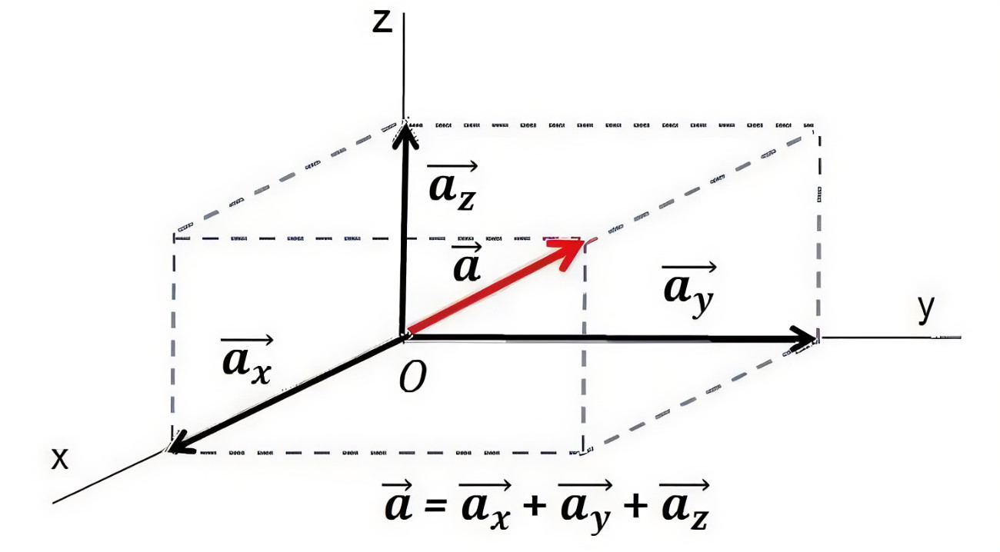
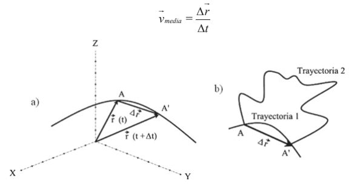

<html lang="es">
<head>
  <meta charset="UTF-8">
  <title>Semana 3 - Jueves Septiembre 25</title>
  
</head>
<body style="display: flex; margin: 0; min-height: 100vh;">
  <nav style="width: 240px; background: #f4f4f4; padding: 2em 1.2em 2em 1.2em; min-height: 100vh; box-shadow: 2px 0 8px #e0e7ef; border-right: 1px solid #e0e7ef; position: fixed; top: 0; left: 0; height: 100vh; overflow-y: auto; z-index: 1000;">
    <h2 style="font-size: 1.2em; color: #1a365d; margin-top: 0; margin-bottom: 1.2em; letter-spacing: 0.5px;">Temario</h2>
    <ul style="list-style: none; padding: 0; margin-bottom: 1.5em;">
      <li><a href="#velocidad">Velocidad</a></li>
      <li><a href="#aceleración">Aceleración</a></li>
      <li><a href="#caída libre">Movimiento uniformemente acelerado, caída libre y saltabilidad</a></li>
    </ul>
    

    <h2 style="font-size: 1.2em; color: #1a365d; margin-top: 0; margin-bottom: 1.2em; letter-spacing: 0.5px;">Recursos</h2>
    <ul style="list-style: none; padding: 0; margin-bottom: 1.5em;">
      <li><a href="https://drive.google.com/file/d/19sQmagrnOjoRbrLMxakj8j26q0wYDHjf/view?usp=sharing">Análisis dimensional</a></li>
    </ul>
    

    <a href="../" style="font-size:1em; color:#1a365d; background:none; border:none; text-decoration:underline;">&#8592; Volver al cronograma</a>
  </nav>
  <main style="flex: 1; padding: 2.5em 3em; background: #fff; min-height: 100vh; margin-left: 240px;">
    <h1 class="titulo-principal">Semana 3 (Jueves Sept 25)</h1>
    <section id="generalidades">
      <h1 class="titulo-principal">Cinemática</h1>
      <a href="res/cinematica.mp4" target="_blank" style="display:block;margin:1em 0;font-weight:bold;color:#2563eb;">🎧 Escucha el podcast: Cinemática Biológica</a>
      

        
La cinemática es una rama de la física que se encarga de describir el movimiento. Esta disciplina es clave tanto para entender la biomecánica que los organismos, como para poder estudiar su comportamiento. <strong>En esta sesión entenderemos los conceptos de velocidad y aceleración, y entenderemos cómo estos conceptos están relacionados con la biofísica y el comportamiento de distintos organismos. </strong>
 Para comprender estos conceptos tenemos que interiorisar claramente, que la posición de un cuerpo es una representación que un observador propone dentro de un sistema de referencia determinado (Figura 1). Dada la estructura tridimencional del espacio, el sistema de referencia más fácil de usar para nosotros son tres ejes perpendiculares que se cortan en un punto, al que llamamos origen (O). El movimiento de cualquier objeto en el espacio lo podemos expresar matemáticamente a partir de vectores que nacen en este origen.
        <figure style="text-align:center; margin:2em 0;">
          
          <figcaption style="color:#2563eb; font-size:1em; margin-top:0.5em;">Figura 1: Sistema de referencia. En este sistema el vector a se expresa como la suma de sus sus componentes rectangulares a = ax + ay + az. </figcaption>
        </figure>
      

    </section>
    <section id="velocidad">
        <h2 class="subtitulo" id="velocidad">Velocidad</h2>
        
La velocidad media(v), como un vector en el espacio tridimensional surge del cambio de la posición o desplazamiento (&Delta;r), en relación al cambio del tiempo (&Delta;t) &mdash; como podemos ver, en este caso el tiempo lo definimos como un escalar y no un vector, porque el tiempo no tiene una dirección (Figura 2).

         <figure style="text-align:center; margin:1em 0;">
          
          <figcaption style="color:#2563eb; font-size:1em; margin-top:0.5em;">Figura 2: La velocidad como vector.</figcaption>
        </figure>
        
Si quisieramos encontrar la velocidad instantanea, es decir, la velocidad en un momento determinado, tendríamos que calcular la velocidad cuando el cambio del tiempo sea diminuto o cuando su límite tienda a cero (Figura 3). Cuando el limite tiende a 0, podemos expresar la velocidad como la derivada de la posición respecto al tiempo dr(t)/dt. Al derivar el vector r, tambien se pueden derivar sus componentes rectangulares en el sistema de referencia (Ecuación 1). Así, el vector de velocidad instantanea, lo podemos expresar como la suma de sus componentes rectangulares en X, Y y Z

        <figure style="text-align:center; margin:2em 0;">
          
          <figcaption style="color:#2563eb; font-size:1em; margin-top:0.5em;">Figura 3. Velocidad instantánea.</figcaption>
        </figure>
        <figure style="text-align:center; margin:2em 0;">
          
          <figcaption style="color:#2563eb; font-size:1em; margin-top:0.5em;">Ecuación 1. Derivada de la velocidad.</figcaption>
        </figure>
        
Las unidades fundamentales para expresar la magnitud de la velocidad en el Sistema Internacional (SI), son: <strong>el metro</strong> para expresar longitud y <strong>el segundo</strong> para referirse al tiempo. <strong>El metro</strong> se ha redefinido en distintos momentos de la historia. En 1983, en la Conferencia General de Pesos y Medidas, se generó la definición actual como: El metro es la longitud recorrida por la luz en el vacío durante unintervalo de tiempo de 1&frasl;299.792.458 segundos. Cabe resaltar que esta definición requiere fijar la velocidad de la luz a un valor exacto de 299.792,458 kilómetros por segundo [Km/s]. <strong>El segundo</strong>, por su parte, se definió finalmente en 1960, con base en parametrós atómicos, como: El segundo es la duración de 9.192.631.770 periodos de la radiación correspondiente a la transición entre los dos niveles hiperfinos del estado fundamental del cesio 133. 
        

          <a href="https://www.pbslearningmedia.org/resource/phy03.sci.phys.mfw.accel/virtual-car-velocity-and-acceleration/" target="_blank" style="font-weight:bold; color:#2563eb; font-size:1.1em;">🔗 Explora la simulación: Virtual Car Velocity and Acceleration (PBS Learning Media)</a>
        

        

          <iframe width="420" height="315" src="https://www.youtube.com/embed/bjcKOCSCF6w?si=_Psjo-uRhGX2w6Q2" title="YouTube video player" frameborder="0" allow="accelerometer; autoplay; clipboard-write; encrypted-media; gyroscope; picture-in-picture; web-share" allowfullscreen></iframe>
          
Video: Ejemplo de velocidad y aceleración

        

    </section>
  </main>
</body>
</html>
