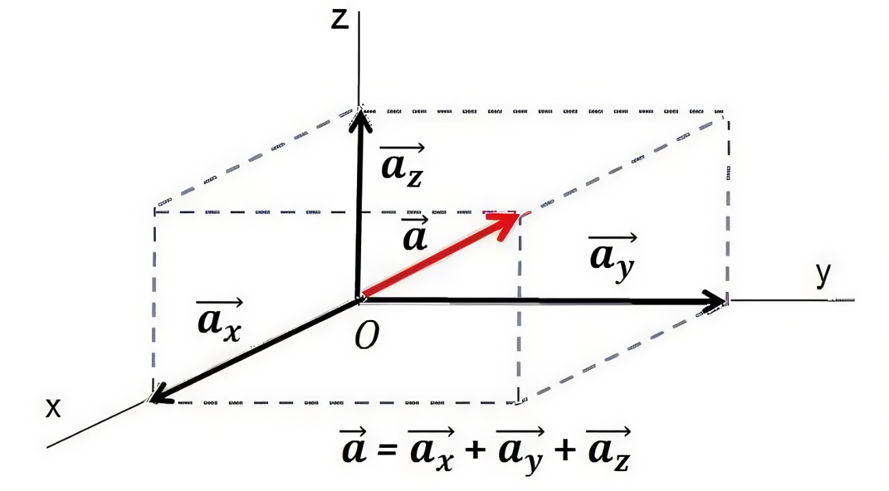
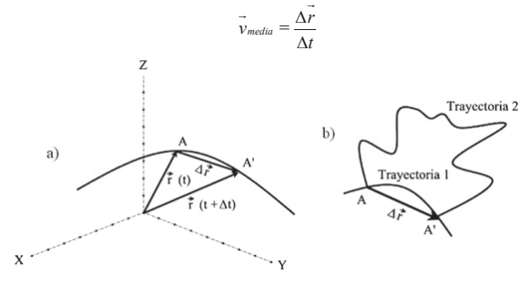
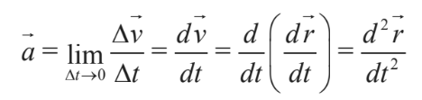
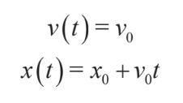
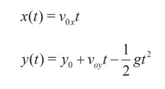
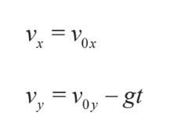
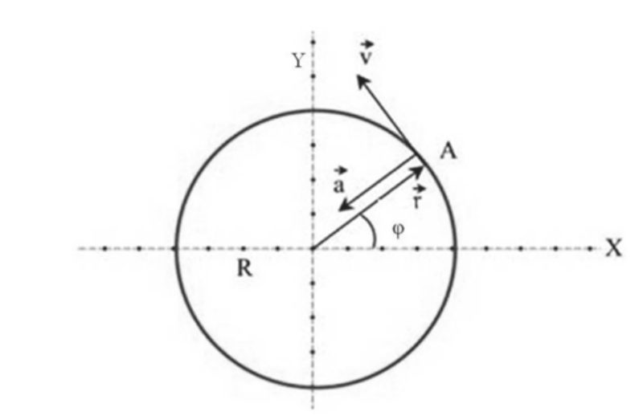
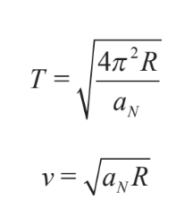

<html lang="es">
<head>
  <meta charset="UTF-8">
  <meta name="viewport" content="width=device-width, initial-scale=1">
  <title>Semana 3 - Cinemática | Biofísica</title>
  
  
  
</head>
<body>
  <!-- NAV LATERAL -->
  <nav>
    <h2>Temario</h2>
    <ul>
      <li><a href="#velocidad">Velocidad</a></li>
      <li><a href="#aceleracion">Aceleración</a></li>
      <li><a href="#tipos">Tipos de movimiento</a></li>
      <li><a href="#implicaciones">Implicaciones biológicas</a></li>
      <li><a href="#ejercicios">Ejercicios resueltos</a></li>
    </ul>
    

    <h2>Recursos</h2>
    <ul>
      <li><a href="../res/Microcurrículo.pdf">Microcurrículo</a></li>
      <li><a href="https://drive.google.com/drive/folders/1-8WeZK28iaaEToQVGgGCnHxfx8AhXX3f?usp=sharing">Fundamentos físicos de los fenómenos biológicos</a></li>
    </ul>
    <h2>Autores</h2>
    <ul>
      <li><a href="https://www.researchgate.net/profile/Hoover-Pantoja-Sanchez">Hoover Pantoja-Sánchez</a></li>
      <li><a href="https://www.researchgate.net/profile/Marco-Giraldo">Marco A. Giraldo</a></li>
    </ul>
    

    <a href="../">&#8592; Volver al cronograma</a>
  </nav>

  <!-- CONTENIDO PRINCIPAL -->
  <main>
    

      <h1 class="titulo-principal">Semana 3 (Jueves Sept 25)</h1>
      <h1 class="titulo-principal">Cinemática</h1>
      
Biofísica &mdash; Descripción del movimiento

      <a href="https://drive.google.com/file/d/1kuDwwEvIyeFISCBg8lIcTo_1Zzv0Ls8Q/view?usp=drive_link" target="_blank" style="display:block;margin:1em 0;font-weight:bold;color:#2563eb;">🎧 Escucha el podcast: Cinemática Biológica</a>

      <!-- ==================== INTRODUCCIÓN ==================== -->
      <section id="generalidades">
        

          
La cinemática es una rama de la física que se encarga de describir el movimiento. Esta disciplina es clave tanto para entender la biomecánica de los organismos, como para poder estudiar su comportamiento. <strong>En esta sesión entenderemos los conceptos de velocidad y aceleración, y entenderemos cómo estos conceptos están relacionados con la biofísica y el comportamiento de distintos organismos.</strong>

          
Para comprender estos conceptos tenemos que interiorizar claramente, que la posición de un cuerpo es una representación que un observador propone dentro de un sistema de referencia determinado (Figura 1). Dada la estructura tridimensional del espacio, el sistema de referencia más fácil de usar para nosotros son tres ejes perpendiculares que se cortan en un punto, al que llamamos origen (O). El movimiento de cualquier objeto en el espacio lo podemos expresar matemáticamente a partir de vectores que nacen en este origen.

          <figure style="text-align:center; margin:2em 0;">
            
            <figcaption style="color:#2563eb; font-size:1em; margin-top:0.5em;">Figura 1: Sistema de referencia. En este sistema el vector \(\vec{a}\) se expresa como la suma de sus componentes rectangulares \(\vec{a} = \vec{a}_x + \vec{a}_y + \vec{a}_z\).</figcaption>
          </figure>
        

        

          <strong>Nota — Sistemas de referencia:</strong> Toda descripción del movimiento depende del sistema de referencia elegido por el observador. Un objeto puede estar en reposo para un observador y en movimiento para otro. Es fundamental definir el sistema de referencia antes de describir cualquier magnitud cinemática.
        

      </section>

      <!-- ==================== VELOCIDAD ==================== -->
      <section id="velocidad">
        <h2 class="subtitulo">Velocidad</h2>

        

          <strong>Definición — Velocidad media:</strong> La velocidad media es el cociente entre el desplazamiento y el intervalo de tiempo transcurrido:
          \[\vec{v} = \frac{\Delta\vec{r}}{\Delta t}\]
          Es una magnitud vectorial cuya dirección coincide con la del desplazamiento.
        

        
La velocidad media (\(\vec{v}\)), como un vector en el espacio tridimensional surge del cambio de la posición o desplazamiento (\(\Delta\vec{r}\)), en relación al cambio del tiempo (\(\Delta t\)) &mdash; como podemos ver, en este caso el tiempo lo definimos como un escalar y no un vector, porque el tiempo no tiene una dirección (Figura 2).

        <figure style="text-align:center; margin:1em 0;">
          
          <figcaption style="color:#2563eb; font-size:1em; margin-top:0.5em;">Figura 2: La velocidad como vector.</figcaption>
        </figure>

        

          <strong>Definición — Velocidad instantánea:</strong> La velocidad instantánea es el límite de la velocidad media cuando el intervalo de tiempo tiende a cero, es decir, la derivada del vector posición respecto al tiempo:
          \[\vec{v}(t) = \lim_{\Delta t \to 0}\frac{\Delta\vec{r}}{\Delta t} = \frac{d\vec{r}}{dt}\]
        

        
Si quisiéramos encontrar la velocidad instantánea, es decir, la velocidad en un momento determinado, tendríamos que calcular la velocidad cuando el cambio del tiempo sea diminuto o cuando su límite tienda a cero (Figura 3). Cuando el límite tiende a 0, podemos expresar la velocidad como la derivada de la posición respecto al tiempo \(\frac{d\vec{r}(t)}{dt}\). Al derivar el vector \(\vec{r}\), también se pueden derivar sus componentes rectangulares en el sistema de referencia. Así, el vector de velocidad instantánea lo podemos expresar como la suma de sus componentes rectangulares en X, Y y Z:

        \[\vec{v} = \frac{dx}{dt}\hat{i} + \frac{dy}{dt}\hat{j} + \frac{dz}{dt}\hat{k}\]

        <figure style="text-align:center; margin:2em 0;">
          
          <figcaption style="color:#2563eb; font-size:1em; margin-top:0.5em;">Figura 3. Componentes del vector en el sistema de referencia.</figcaption>
        </figure>

        

          <strong>Nota — Análisis dimensional de la velocidad:</strong> Las dimensiones de la velocidad son \([v] = LT^{-1}\). En el SI se expresa en metros por segundo (m/s). Otras unidades comunes son km/h y cm/s.
        

        
Las unidades fundamentales para expresar la magnitud de la velocidad en el Sistema Internacional (SI), son: <strong>el metro</strong> para expresar longitud y <strong>el segundo</strong> para referirse al tiempo. <strong>El metro</strong> se ha redefinido en distintos momentos de la historia. En 1983, en la Conferencia General de Pesos y Medidas, se generó la definición actual como: El metro es la longitud recorrida por la luz en el vacío durante un intervalo de tiempo de \(\frac{1}{299\,792\,458}\) segundos. Cabe resaltar que esta definición requiere fijar la velocidad de la luz a un valor exacto de 299.792,458 kilómetros por segundo [km/s]. <strong>El segundo</strong>, por su parte, se definió finalmente en 1960, con base en parámetros atómicos, como: El segundo es la duración de 9.192.631.770 periodos de la radiación correspondiente a la transición entre los dos niveles hiperfinos del estado fundamental del cesio 133.

        

          <strong>Ejemplo — Conversión de velocidad (delfín):</strong> Un delfín nariz de botella nada a una rapidez de 36 km/h. ¿Cuál es su rapidez en m/s?
            
          <strong>Solución:</strong> Convertimos las unidades:
          \[36 \;\frac{\text{km}}{\text{h}} \times \frac{1000 \;\text{m}}{1 \;\text{km}} \times \frac{1 \;\text{h}}{3600 \;\text{s}} = 10 \;\frac{\text{m}}{\text{s}}\]
          El delfín nada a 10 m/s.
        

        

          <a href="https://www.pbslearningmedia.org/resource/phy03.sci.phys.mfw.accel/virtual-car-velocity-and-acceleration/" target="_blank" style="font-weight:bold; color:#2563eb; font-size:1.1em;">🔗 Explora la simulación: Virtual Car Velocity and Acceleration (PBS Learning Media)</a>
        

        

          <iframe width="420" height="315" src="https://www.youtube.com/embed/bjcKOCSCF6w?si=_Psjo-uRhGX2w6Q2" title="YouTube video player" frameborder="0" allow="accelerometer; autoplay; clipboard-write; encrypted-media; gyroscope; picture-in-picture; web-share" allowfullscreen></iframe>
          
Video 1. Comparación de la magnitud de la velocidad de distintos animales.

        

      </section>

      <!-- ==================== ACELERACIÓN ==================== -->
      <section id="aceleracion">
        <h2 class="subtitulo">Aceleración</h2>

        

          <strong>Definición — Aceleración:</strong> La aceleración es la tasa de cambio de la velocidad respecto al tiempo, o equivalentemente, la segunda derivada del vector posición:
          \[\vec{a} = \frac{d\vec{v}}{dt} = \frac{d^2\vec{r}}{dt^2}\]
        

        
Normalmente los objetos no se mueven con velocidad constante. La dirección y la magnitud varía en función del tiempo. La aceleración puede definirse como el cambio en la dirección y la magnitud de la velocidad respecto al cambio del tiempo en cada punto de la trayectoria.

        <figure style="text-align:center; margin:2em 0;">
          
          <figcaption style="color:#2563eb; font-size:1em; margin-top:0.5em;">Figura 4. Representación gráfica de la aceleración.</figcaption>
        </figure>

        

          <strong>Nota — Análisis dimensional de la aceleración:</strong> Las dimensiones de la aceleración son \([a] = LT^{-2}\). En el SI se expresa en metros por segundo al cuadrado (m/s²). La aceleración de la gravedad en la superficie terrestre es aproximadamente \(g \approx 9{,}8\;\text{m/s}^2\).
        

      </section>

      <!-- ==================== TIPOS DE MOVIMIENTO ==================== -->
      <section id="tipos">
        <h2 class="subtitulo">Tipos de movimiento</h2>
        
La aceleración es el parámetro que caracteriza el tipo de trayectoria que sigue un cuerpo. A continuación se describen los tipos de movimiento ligados al tipo de aceleración.

        
La siguiente herramienta se puede usar para observar los distintos tipos de movimiento:

        

          <a href="https://iwant2study.org/lookangejss/02_newtonianmechanics_2kinematics/ejss_model_Kinematicsfukwun/index.html" target="_blank" style="font-weight:bold; color:#2563eb; font-size:1.1em;">🔗 Simulación interactiva de cinemática (Iwant2study.org)</a>
        

        <!-- Movimiento uniforme rectilíneo -->
        <h3 class="subtitulo2">Movimiento uniforme rectilíneo</h3>
        
Cuando la aceleración es igual a 0. El reposo es el caso particular de movimiento uniforme y rectilíneo en el que la velocidad inicial \(\vec{v}_0 = 0\).

        

          Las ecuaciones del movimiento uniforme rectilíneo son:
          \[\vec{v} = \vec{v}_0 = \text{const}\]
          \[\vec{r}(t) = \vec{r}_0 + \vec{v}_0\, t\]
        

        <figure style="text-align:center; margin:2em 0;">
          
          <figcaption style="color:#2563eb; font-size:1em; margin-top:0.5em;">Figura 5. Movimiento uniforme rectilíneo.</figcaption>
        </figure>

        <!-- Movimiento uniformemente acelerado -->
        <h3 class="subtitulo2">Movimiento uniformemente acelerado</h3>
        
Si el movimiento uniformemente acelerado se da en una dimensión, es decir, sobre una línea, se puede expresar de la siguiente manera:

        

          Ecuaciones del movimiento uniformemente acelerado (1D):
          \[x(t) = x_0 + v_0\, t + \frac{1}{2}a\,t^2\]
          \[v(t) = v_0 + a\,t\]
        

        
Sin embargo, el caso más general de movimiento uniformemente acelerado está siempre contenido en un plano, por eso se puede interpretar este movimiento en el plano de referencia que forman los ejes X e Y que forman la velocidad inicial y la aceleración. \(\vec{a} = (0, -g)\) con \(g = 9{,}8\;\text{m/s}^2\).

        

          Ecuaciones de movimiento de proyectil (2D):
          \[x(t) = v_0 \cos\theta \cdot t\]
          \[y(t) = v_0 \sin\theta \cdot t - \frac{1}{2}g\,t^2\]
          Componentes de la velocidad:
          \[v_x(t) = v_0 \cos\theta\]
          \[v_y(t) = v_0 \sin\theta - g\,t\]
        

        

          <figure style="text-align:center; width: 220px;">
            
            <figcaption style="color:#2563eb; font-size:1em; margin-top:0.5em;">Figura 6. Trayectoria de un proyectil.</figcaption>
          </figure>
          <figure style="text-align:center; width: 220px;">
            
            <figcaption style="color:#2563eb; font-size:1em; margin-top:0.5em;">Figura 7. Componentes de la velocidad en movimiento de proyectil.</figcaption>
          </figure>
        

        

          <a href="https://phet.colorado.edu/sims/html/projectile-data-lab/latest/projectile-data-lab_all.html?locale=es" target="_blank" style="font-weight:bold; color:#2563eb; font-size:1.1em;">🔗 Herramienta interactiva: Laboratorio de datos de proyectiles (PhET Colorado)</a>
        

        <!-- Movimiento circular uniforme -->
        <h3 class="subtitulo2">Movimiento circular uniforme</h3>
        
En el movimiento circular uniforme, un objeto se desplaza sobre una trayectoria circular con rapidez constante. Aunque la rapidez no cambia, la dirección de la velocidad varía continuamente, lo que implica la existencia de una aceleración centrípeta dirigida hacia el centro de la circunferencia.

        

          Ecuaciones del movimiento circular uniforme:
          \[\omega = \frac{2\pi}{T}\]
          \[a_c = \frac{v^2}{r} = \omega^2 r\]
          donde \(\omega\) es la velocidad angular, \(T\) el período, \(v\) la rapidez tangencial, \(r\) el radio y \(a_c\) la aceleración centrípeta.
        

        

          <figure style="text-align:center; width:400px;">
            
            <figcaption style="color:#2563eb; font-size:1em; margin-top:0.5em;">Figura 8. Movimiento circular uniforme.</figcaption>
          </figure>
          <figure style="text-align:center; width: 220px;">
            
            <figcaption style="color:#2563eb; font-size:1em; margin-top:0.5em;">Figura 9. Variables del movimiento circular.</figcaption>
          </figure>
        

      </section>

      <!-- ==================== IMPLICACIONES BIOLÓGICAS ==================== -->
      <section id="implicaciones">
        <h2 class="subtitulo">Implicaciones en la biología de los animales</h2>

        
Los principios cinemáticos son fundamentales para comprender el movimiento de los organismos vivos. Desde el vuelo de las aves hasta la locomoción de los insectos, la física del movimiento revela adaptaciones evolutivas extraordinarias.

        <h3 class="subtitulo2">Saltabilidad y tamaño corporal</h3>
        
La <strong>saltabilidad</strong> (capacidad de salto) de los animales presenta una relación sorprendente con el tamaño corporal. Animales de tamaños muy distintos &mdash;desde una pulga hasta un canguro&mdash; alcanzan alturas de salto del mismo orden de magnitud (aproximadamente 1 metro en los casos más extremos). Esto se debe a que la fuerza muscular escala proporcionalmente con la sección transversal del músculo (\(\propto L^2\)), mientras que la masa escala con el volumen (\(\propto L^3\)). La energía específica por unidad de masa que un músculo puede liberar es aproximadamente constante entre especies, lo que resulta en alturas de salto comparables independientemente del tamaño del animal.

        <h3 class="subtitulo2">Velocidad terminal y tamaño</h3>
        
La velocidad terminal &mdash;la velocidad máxima que alcanza un cuerpo en caída libre cuando la resistencia del aire iguala al peso&mdash; depende fuertemente del tamaño del organismo. Los animales pequeños, como insectos y ratones, tienen una relación superficie/volumen mucho mayor que los animales grandes. Esto significa que la resistencia del aire (proporcional al área) frena proporcionalmente más a un organismo pequeño. Un ratón puede caer desde una gran altura y sobrevivir gracias a su baja velocidad terminal (\(\approx 13\;\text{m/s}\)), mientras que un caballo alcanzaría velocidades letales. Como observó J. B. S. Haldane: <em>"Un ratón camina, un perro se lastima, un caballo muere"</em>.

        <h3 class="subtitulo2">Aceleración del guepardo</h3>
        
El guepardo (<em>Acinonyx jubatus</em>) es el animal terrestre más rápido, alcanzando hasta 29 m/s (aproximadamente 104 km/h). Sin embargo, lo más impresionante desde el punto de vista cinemático es su <strong>aceleración</strong>: puede pasar de 0 a 100 km/h en aproximadamente 3 segundos, lo que equivale a una aceleración media de:

        \[a \approx \frac{27{,}8\;\text{m/s}}{3\;\text{s}} \approx 9{,}3\;\frac{\text{m}}{\text{s}^2} \approx g\]
        
Esta aceleración es comparable a la aceleración de la gravedad y supera la de muchos automóviles deportivos. La adaptación biomecánica que lo permite incluye una columna vertebral extremadamente flexible, garras semi-retráctiles para tracción, y una cola larga que funciona como timón.

        <h3 class="subtitulo2">El picado del halcón peregrino</h3>
        
El halcón peregrino (<em>Falco peregrinus</em>) realiza picadas de caza que pueden superar los 300 km/h (aproximadamente 83 m/s), convirtiéndolo en el animal más rápido del planeta. Durante el picado, el halcón adopta una postura aerodinámica que minimiza la resistencia del aire, plegando las alas contra el cuerpo. La aceleración durante las fases iniciales del picado puede superar los \(2g\). Estructuras especiales en sus fosas nasales (conos óseos) permiten la respiración a estas velocidades al desviar el flujo de aire, y una membrana nictitante protege sus ojos.

        

          <strong>Nota:</strong> Estos ejemplos ilustran cómo la selección natural ha optimizado parámetros cinemáticos &mdash;velocidad, aceleración y trayectoria&mdash; en función de las necesidades ecológicas de cada especie: caza, escape de depredadores, migración y forrajeo.
        

      </section>

      <!-- ==================== EJERCICIOS RESUELTOS ==================== -->
      <section id="ejercicios">
        <h2 class="subtitulo">Ejercicios resueltos</h2>

        <!-- Ejercicio 1: Delfín -->
        <h3 class="subtitulo2">Ejercicio: Cinemática de un delfín</h3>
        
Un delfín parte del reposo y acelera uniformemente a \(2\;\text{m/s}^2\) durante 5 segundos. Después, continúa moviéndose con velocidad constante. Determinar:

        <ol style="line-height:1.7;">
          <li>La velocidad máxima alcanzada.</li>
          <li>La distancia recorrida durante la fase de aceleración.</li>
          <li>La distancia total recorrida después de 15 segundos desde el inicio.</li>
        </ol>

        

          <strong>Solución:</strong>  

          <strong>1. Velocidad máxima:</strong> 
          La velocidad máxima se alcanza al final de la fase de aceleración (en \(t = 5\;\text{s}\)). Usando la ecuación de velocidad del movimiento uniformemente acelerado:
          \[v(t) = v_0 + a\,t\]
          Con \(v_0 = 0\), \(a = 2\;\text{m/s}^2\) y \(t = 5\;\text{s}\):
          \[v_{\max} = 0 + 2 \times 5 = 10\;\text{m/s}\]

           <strong>2. Distancia durante la aceleración:</strong> 
          Usando la ecuación de posición:
          \[x(t) = x_0 + v_0\,t + \frac{1}{2}a\,t^2\]
          Con \(x_0 = 0\), \(v_0 = 0\):
          \[d_1 = \frac{1}{2}(2)(5)^2 = 25\;\text{m}\]

           <strong>3. Distancia total en 15 segundos:</strong> 
          Después de los primeros 5 s, el delfín se mueve con velocidad constante \(v = 10\;\text{m/s}\) durante los siguientes \(15 - 5 = 10\;\text{s}\):
          \[d_2 = v \cdot t = 10 \times 10 = 100\;\text{m}\]
          La distancia total es:
          \[d_{\text{total}} = d_1 + d_2 = 25 + 100 = 125\;\text{m}\]
        

        <!-- Ejercicio 2: Pez saltarín -->
        <h3 class="subtitulo2">Ejercicio: Movimiento de proyectil biológico</h3>
        
Un pez saltarín (<em>Periophthalmus</em>, mudskipper) se lanza desde el suelo con un ángulo de \(45°\) respecto a la horizontal y una rapidez inicial de \(2\;\text{m/s}\). Usando \(g = 9{,}8\;\text{m/s}^2\), determinar:

        <ol style="line-height:1.7;">
          <li>La altura máxima alcanzada.</li>
          <li>El alcance horizontal (rango).</li>
        </ol>

        

          <strong>Solución:</strong>  

          <strong>Datos:</strong> \(v_0 = 2\;\text{m/s}\), \(\theta = 45°\), \(g = 9{,}8\;\text{m/s}^2\).  

          Componentes iniciales de la velocidad:
          \[v_{0x} = v_0 \cos 45° = 2 \times \frac{\sqrt{2}}{2} \approx 1{,}414\;\text{m/s}\]
          \[v_{0y} = v_0 \sin 45° = 2 \times \frac{\sqrt{2}}{2} \approx 1{,}414\;\text{m/s}\]

           <strong>1. Altura máxima:</strong> 
          En el punto más alto, \(v_y = 0\). Usando \(v_y = v_{0y} - g\,t\):
          \[t_{\text{subida}} = \frac{v_{0y}}{g} = \frac{1{,}414}{9{,}8} \approx 0{,}144\;\text{s}\]
          La altura máxima es:
          \[y_{\max} = v_{0y}\,t_{\text{subida}} - \frac{1}{2}g\,t_{\text{subida}}^2\]
          \[y_{\max} = 1{,}414 \times 0{,}144 - \frac{1}{2}(9{,}8)(0{,}144)^2\]
          \[y_{\max} \approx 0{,}204 - 0{,}102 \approx 0{,}102\;\text{m} \approx 10{,}2\;\text{cm}\]
          También se puede obtener directamente con la fórmula:
          \[y_{\max} = \frac{v_0^2 \sin^2\theta}{2g} = \frac{(2)^2 \sin^2 45°}{2 \times 9{,}8} = \frac{4 \times 0{,}5}{19{,}6} \approx 0{,}102\;\text{m}\]

           <strong>2. Alcance horizontal:</strong> 
          El tiempo total de vuelo es \(t_{\text{total}} = 2\,t_{\text{subida}} \approx 0{,}289\;\text{s}\). El alcance es:
          \[R = v_{0x} \times t_{\text{total}} = 1{,}414 \times 0{,}289 \approx 0{,}408\;\text{m}\]
          Usando la fórmula directa del alcance:
          \[R = \frac{v_0^2 \sin 2\theta}{g} = \frac{(2)^2 \sin 90°}{9{,}8} = \frac{4}{9{,}8} \approx 0{,}408\;\text{m} \approx 40{,}8\;\text{cm}\]
          El pez saltarín alcanza una altura máxima de aproximadamente <strong>10,2 cm</strong> y un alcance horizontal de aproximadamente <strong>40,8 cm</strong>.
        

      </section>

    
<!-- /.container -->
  </main>
</body>
</html>
