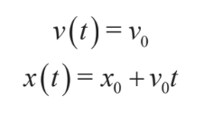
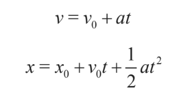
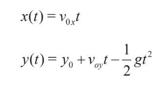
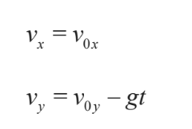
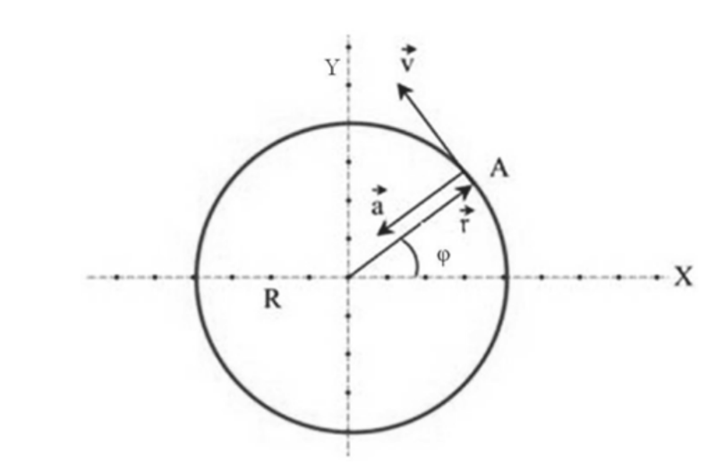
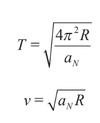

<html lang="es">
<head>
  <meta charset="UTF-8">
  <title>Semana 4 - Jueves Octubre 1</title>
  
</head>
<body style="display: flex; margin: 0; min-height: 100vh;">
  <nav style="width: 240px; background: #f4f4f4; padding: 2em 1.2em 2em 1.2em; min-height: 100vh; box-shadow: 2px 0 8px #e0e7ef; border-right: 1px solid #e0e7ef; position: fixed; top: 0; left: 0; height: 100vh; overflow-y: auto; z-index: 1000;">
    <h2 style="font-size: 1.2em; color: #1a365d; margin-top: 0; margin-bottom: 1.2em; letter-spacing: 0.5px;">Temario</h2>
    <ul style="list-style: none; padding: 0; margin-bottom: 1.5em;">
      <li><a href="#1">Leyes de Newton</a></li>
      <li><a href="#aceleración">Gravitación</a></li>
      <li><a href="#tip">Fuerzas de contacto, rozamiento, inerciales y centrífugas</a></li>
      <li><a href="#implicaciones">Trabajo, energía cinética, energía potencial y gasto energético</a></li>
    </ul>
    

    <h2 style="font-size: 1.2em; color: #1a365d; margin-top: 0; margin-bottom: 1.2em; letter-spacing: 0.5px;">Recursos</h2>
    <ul style="list-style: none; padding: 0; margin-bottom: 1.5em;">
      <li><a href="../res/Microcurrículo.pdf"> Microcurrículo</a></li>
      <li><a href="https://drive.google.com/drive/folders/1-8WeZK28iaaEToQVGgGCnHxfx8AhXX3f?usp=sharing"> Fundamentos físicos de los fenómenos biológicos</a></li>
    </ul>
    <h2 style="font-size: 1.2em; color: #1a365d; margin-top: 0; margin-bottom: 1.2em; letter-spacing: 0.5px;">Autores</h2>
    <ul style="list-style: none; padding: 0; margin-bottom: 1.5em;">
      <li><a href="https://www.researchgate.net/profile/Hoover-Pantoja-Sanchez">Hoover Pantoja-Sánchez</a></li>
      <li><a href="https://www.researchgate.net/profile/Marco-Giraldo">Marco A.Giraldo</a></li>
    </ul>
    

    <a href="../" style="font-size:1em; color:#1a365d; background:none; border:none; text-decoration:underline;">&#8592; Volver al cronograma</a>
  </nav>
  <main style="flex: 1; padding: 2.5em 3em; background: #fff; min-height: 100vh; margin-left: 240px;">
    <h1 class="titulo-principal">Semana 4 (Jueves Oct 1)</h1>
    <section id="generalidades">
      <h1 class="titulo-principal">Dinámica, Fuerzas elementales, Trabajo y Energía</h1>
      <a href="res/cinematica.mp4" target="_blank" style="display:block;margin:1em 0;font-weight:bold;color:#2563eb;">🎧 Escucha el podcast: Cinemática Biológica</a>
      

        
La dinámica se refiere al estudio de los movimientos de los cuerpos y las fuerzas que los causan. En el contexto de la ecología marina, la dinámica es esencial para entender cómo los animales de ecosistemas marinos se desplazan y cómo las fuerzas, como la gravedad y las fuerzas de arrastre del aire o el agua, afectan su locomoción. Las leyes de Newton son fundamentales en este campo, pues describen cómo las fuerzas ejercen cambios sobre los objetos.

        

        Las fuerzas elementales son las interacciones fundamentales que rigen todos los fenómenos físicos en el universo. En el contexto de la biofísica marina, las tres fuerzas principales que afectan el movimiento y las interacciones de los organismos marinos son la gravedad, la fuerza electromagnética y la fuerza de fricción.

        

          <li>Gravedad: La gravedad es la fuerza que atrae a los cuerpos hacia el centro de la Tierra. En el caso de los organismos marinos, la gravedad afecta su peso, lo que determina su flotabilidad. Un pez, por ejemplo, necesita generar una fuerza de sustentación a través de sus aletas y vejiga natatoria para contrarrestar su peso y mantenerse a flote. Esta es una manifestación de la ley de Arquímedes, que establece que cualquier objeto sumergido en un fluido experimenta una fuerza hacia arriba igual al peso del fluido desplazado.</li>
          <li>Fuerzas electromagnéticas: Las interacciones electromagnéticas son cruciales en las bioprocesos de los organismos marinos. Por ejemplo, la forma en que los neurotransmisores se comunican entre las células nerviosas o la forma en que los peces utilizan sus electrorreceptores para detectar presas o evitar depredadores. Las fuerzas electromagnéticas también influyen en la estructura de las moléculas biológicas, como proteínas y ácidos nucleicos, esenciales para el funcionamiento de los sistemas biológicos marinos.</li>
          <li>Fuerza de fricción: La fricción es la fuerza que resiste el movimiento relativo entre dos superficies en contacto. En el caso de los organismos marinos, la fricción se presenta cuando se mueven a través del agua. El arrastre es una forma de fricción que enfrenta cualquier objeto que se desplace en un fluido. Por ejemplo, el movimiento de los peces a través del agua está sujeto a la resistencia del fluido, que depende de la forma del pez, la velocidad de movimiento y la viscosidad del agua.</li>
        

        
En física, el trabajo y la energía son conceptos estrechamente relacionados. El trabajo se define como la cantidad de energía transferida por una fuerza que actúa sobre un objeto y lo mueve. Matemáticamente, el trabajo se calcula como el producto de la fuerza aplicada sobre un objeto y la distancia que este recorre en la dirección de la fuerza.

        
En el contexto de la biofísica marina, el trabajo es realizado principalmente por los músculos de los animales marinos, como los peces, cuando mueven sus aletas para nadar. La energía generada en estos movimientos proviene de los alimentos que los animales consumen, que se transforman en energía química. Esta energía química se convierte en energía mecánica cuando los músculos se contraen para realizar trabajo.

        
 Por otro lado, la energía se refiere a la capacidad de realizar trabajo. Hay varias formas de energía que intervienen en los procesos biológicos marinos:

        

          <li>Energía cinética: Es la energía asociada con el movimiento. En los animales marinos, se manifiesta cuando nadan, se desplazan o realizan saltos.
          <li>Energía potencial: Es la energía almacenada en un sistema debido a su posición. En los animales marinos, un ejemplo de energía potencial es la energía almacenada en los músculos antes de que se contraigan para realizar un movimiento.</li>
          <li>Energía térmica: Es la energía asociada con la temperatura de un objeto. En los animales ectotérmicos marinos, como los peces, la energía térmica del entorno afecta su metabolismo y eficiencia en el uso de la energía.</li>
          <li>La conservación de la energía es un principio fundamental en biofísica. La primera ley de la termodinámica establece que la energía no se crea ni se destruye, solo se transforma de una forma a otra. En los animales marinos, esto significa que la energía que obtienen de su alimento se convierte en trabajo mecánico y calor, pero la cantidad total de energía se conserva.</li>
        

      

    </section>
    <section id="leyes">
        <h2 class="subtitulo" id="1">Leyes de Newton</h2>
        <a href="https://drive.google.com/file/d/1Nit4gJoF3zFVd2bvJrHslhA-PocMyLJD/view?usp=drive_link" target="_blank" style="display:block;margin:1em 0;font-weight:bold;color:#2563eb;">🎧 Newton La_Dinámica</a>
        
La velocidad media(v), como un vector en el espacio tridimensional surge del cambio de la posición o desplazamiento (&Delta;r), en relación al cambio del tiempo (&Delta;t) &mdash; como podemos ver, en este caso el tiempo lo definimos como un escalar y no un vector, porque el tiempo no tiene una dirección (Figura 2).

         <figure style="text-align:center; margin:1em 0;">
          
          <figcaption style="color:#2563eb; font-size:1em; margin-top:0.5em;">Figura 2: La velocidad como vector.</figcaption>
        </figure>
        
Si quisieramos encontrar la velocidad instantanea, es decir, la velocidad en un momento determinado, tendríamos que calcular la velocidad cuando el cambio del tiempo sea diminuto o cuando su límite tienda a cero (Figura 3). Cuando el limite tiende a 0, podemos expresar la velocidad como la derivada de la posición respecto al tiempo dr(t)/dt. Al derivar el vector r, tambien se pueden derivar sus componentes rectangulares en el sistema de referencia (Ecuación 1). Así, el vector de velocidad instantanea, lo podemos expresar como la suma de sus componentes rectangulares en X, Y y Z

        <figure style="text-align:center; margin:2em 0;">
          
          <figcaption style="color:#2563eb; font-size:1em; margin-top:0.5em;">Figura 3. Velocidad instantánea.</figcaption>
        </figure>
        <figure style="text-align:center; margin:2em 0;">
          
          <figcaption style="color:#2563eb; font-size:1em; margin-top:0.5em;">Ecuación 1. La velocidad puede definirse como la derivada del desplazamiento respecto al tiempo.</figcaption>
        </figure>
        
Las unidades fundamentales para expresar la magnitud de la velocidad en el Sistema Internacional (SI), son: <strong>el metro</strong> para expresar longitud y <strong>el segundo</strong> para referirse al tiempo. <strong>El metro</strong> se ha redefinido en distintos momentos de la historia. En 1983, en la Conferencia General de Pesos y Medidas, se generó la definición actual como: El metro es la longitud recorrida por la luz en el vacío durante unintervalo de tiempo de 1&frasl;299.792.458 segundos. Cabe resaltar que esta definición requiere fijar la velocidad de la luz a un valor exacto de 299.792,458 kilómetros por segundo [Km/s]. <strong>El segundo</strong>, por su parte, se definió finalmente en 1960, con base en parametrós atómicos, como: El segundo es la duración de 9.192.631.770 periodos de la radiación correspondiente a la transición entre los dos niveles hiperfinos del estado fundamental del cesio 133. Así las dimensiones de la velocidad son [v] = LT-1.
        

          <a href="https://www.pbslearningmedia.org/resource/phy03.sci.phys.mfw.accel/virtual-car-velocity-and-acceleration/" target="_blank" style="font-weight:bold; color:#2563eb; font-size:1.1em;">🔗 Explora la simulación: Virtual Car Velocity and Acceleration (PBS Learning Media)</a>
        

        

          <iframe width="420" height="315" src="https://www.youtube.com/embed/bjcKOCSCF6w?si=_Psjo-uRhGX2w6Q2" title="YouTube video player" frameborder="0" allow="accelerometer; autoplay; clipboard-write; encrypted-media; gyroscope; picture-in-picture; web-share" allowfullscreen></iframe>
          
Video 1. Comparación de la magnitud de la velocidad de distintos animales.

        

    </section>
    <section id="aceleración">
        <h2 class="subtitulo" id="aceleración">Aceleración</h2>
        
Normalmente los objetos no se mueven con velocidad constante. La dirección y la magnitud varía en función del tiempo. La aceleración puede definirse como el cambio en la dirección y la magnitud de la velocidad respecto al cambio del tiempo en cada punto de la trayectoria (Ecuación 2). Por esta razón la dimensión de la aceleración es [a]=LT-2.
        <figure style="text-align:center; margin:2em 0;">
          
          <figcaption style="color:#2563eb; font-size:1em; margin-top:0.5em;">Ecuación 2. La aceleración es la derivada de la velocidad respecto al tiempo.</figcaption>
        </figure>
    </section>  
    <section id="tip">
        <h2 class="subtitulo" id="tip">Tipos de movimiento</h2>
        
La aceleración es el parámetro que caracteriza el tipo de trayectoria que sigue un cuerpo, a continuación se describen los tipos de movimiento ligados a el tipo de aceleración.
 La siguiente herramienta se puede usar para observar los distintos tipos de movimiento.
        

            <a href="https://iwant2study.org/lookangejss/02_newtonianmechanics_2kinematics/ejss_model_Kinematicsfukwun/index.html" target="_blank" style="font-weight:bold; color:#2563eb; font-size:1.1em;">🔗 Simulación interactiva de cinemática (Iwant2study.org)</a>
        

        <ul>
          <li>Movimiento uniforme rectilineo</li>
            
Cuando la aceleración es igual a 0. El reposo es el caso particular de movimiento uniforme y rectlíneo en el que la velocidad inicial v0=0. 

            <figure style="text-align:center; margin:2em 0;">
              
              <figcaption style="color:#2563eb; font-size:1em; margin-top:0.5em;">Ecuación 3 y 4. La aceleración es la derivada de la velocidad respecto al tiempo.</figcaption>
            </figure>
          <li>Movimiento uniformemente acelerado</li>
          
Si el movimiento uniformemente acelerado se da en una dimensión, es decir, sobre una linea, se puede expresar de la siguiente manera
 
          <figure style="text-align:center; width: 220px;">
            
            <figcaption style="color:#2563eb; font-size:1em; margin-top:0.5em;">Ecuación 5 y 6. Ecuaciones de posición en un movimiento uniformemente acelerado.</figcaption>
          </figure>
          
Sin embargo, el caso más general de movimiento uniformemente acelerado está siempre contenido en un plano, por eso se puede interpretar este movimiento en el plano de referencia que forman los ejes X Y que forman la velocidad inicial y la aceleración.
          a=(0,-g) con g=9,8 m/s2

            

              <figure style="text-align:center; width: 220px;">
                
                <figcaption style="color:#2563eb; font-size:1em; margin-top:0.5em;">Ecuación 7 y 8. Ecuaciones de posición en un movimiento uniformemente acelerado.</figcaption>
              </figure>
              <figure style="text-align:center; width: 220px;">
                
                <figcaption style="color:#2563eb; font-size:1em; margin-top:0.5em;">Ecuación 9 y 10. Ecuaciones de velocidad en un movimiento uniformemente acelerado </figcaption>
              </figure>
            

              

                <a href="https://phet.colorado.edu/sims/html/projectile-data-lab/latest/projectile-data-lab_all.html?locale=es" target="_blank" style="font-weight:bold; color:#2563eb; font-size:1.1em;">🔗 Herramienta interactiva: Laboratorio de datos de proyectiles (PhET Colorado)</a>
              

          <li>Movimiento circular uniforme</li>
                  

                  <figure style="text-align:center; width:400px;">
                    
                    <figcaption style="color:#2563eb; font-size:1em; margin-top:0.5em;">Figura: Movimiento circular 1</figcaption>
                  </figure>
                  <figure style="text-align:center; width: 220px;">
                    
                    <figcaption style="color:#2563eb; font-size:1em; margin-top:0.5em;">Figura: Movimiento circular 2</figcaption>
                  </figure>
                

        </ul>
    </section>  
    <section id="implicaciones">
    <h2 class="subtitulo" id="aceleración">Implicaciones en la biología de los animales</h2>
    </section>
  </main>
</body>
</html>
