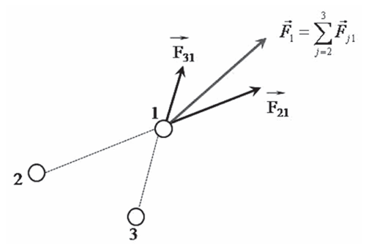
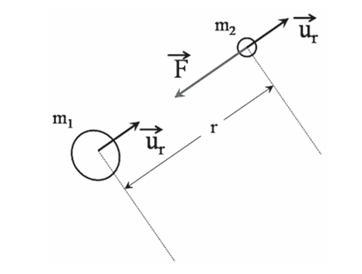
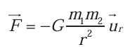
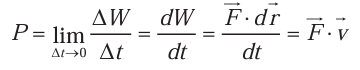
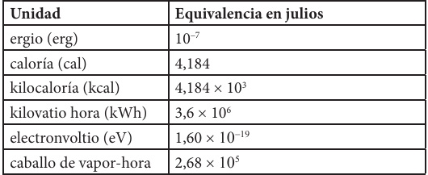

<html lang="es">
<head>
  <meta charset="UTF-8">
  <title>Semana 4 – Dinámica, Trabajo y Energía</title>
  
  
  
</head>
<body>
  <!-- NAV -->
  <nav>
    <h2>Temario</h2>
    <ul>
      <li><a href="#leyes-de-newton">Leyes de Newton</a></li>
      <li><a href="#fuerzas">Fuerzas fundamentales</a></li>
      <li><a href="#trabajo-energia">Trabajo y energía</a></li>
      <li><a href="#ejercicios">Ejercicios resueltos</a></li>
    </ul>
    

    <h2>Recursos</h2>
    <ul>
      <li><a href="../res/Microcurrículo.pdf">Microcurrículo</a></li>
      <li><a href="https://drive.google.com/drive/folders/1-8WeZK28iaaEToQVGgGCnHxfx8AhXX3f?usp=sharing">Fundamentos físicos de los fenómenos biológicos</a></li>
    </ul>
    <h2>Autores</h2>
    <ul>
      <li><a href="https://www.researchgate.net/profile/Hoover-Pantoja-Sanchez">Hoover Pantoja-Sánchez</a></li>
      <li><a href="https://www.researchgate.net/profile/Marco-Giraldo">Marco A. Giraldo</a></li>
    </ul>
    

    <a href="../" style="color:#1a365d; text-decoration:underline;">&#8592; Volver al cronograma</a>
  </nav>

  <!-- MAIN -->
  <main>
    

      <h1 class="titulo-principal">Dinámica, Trabajo y Energía</h1>

      
La dinámica se refiere al estudio de los movimientos de los cuerpos y las fuerzas que los causan. En el contexto de la ecología marina, la dinámica es esencial para entender cómo los animales de ecosistemas marinos se desplazan y cómo las fuerzas, como la gravedad y las fuerzas de arrastre del aire o el agua, afectan su locomoción. Las leyes de Newton son fundamentales en este campo, pues describen cómo las fuerzas ejercen cambios sobre los objetos.

      

        

          <iframe src="https://www.youtube.com/embed/uw2WhlxDdRQ?si=McWMAN3AtoTL8GQr" title="Primer genio de la física – Isaac Newton" allow="accelerometer; autoplay; clipboard-write; encrypted-media; gyroscope; picture-in-picture; web-share" allowfullscreen></iframe>
          
Video 1. Primer genio de la física – Isaac Newton ¿Por qué se llaman Leyes de Newton?

        

      

      
Existen fuerzas elementales fundamentales que rigen todos los fenómenos físicos en el universo. En el contexto de la biofísica marina, las tres fuerzas principales que afectan el movimiento y las interacciones de los organismos marinos son la gravedad, la fuerza electromagnética y la fuerza de fricción.

      <ul>
        <li><strong>Gravedad:</strong> Fuerza que atrae a los cuerpos hacia el centro de la Tierra. En organismos marinos afecta el peso y la flotabilidad (ley de Arquímedes).</li>
        <li><strong>Fuerzas electromagnéticas:</strong> Fundamentales en neurotransmisión, detección sensorial y estructura de proteínas y ácidos nucleicos.</li>
        <li><strong>Fricción o arrastre:</strong> Resistencia del fluido al movimiento; depende de forma, velocidad y viscosidad del agua.</li>
      </ul>

      
En física, el trabajo y la energía son conceptos estrechamente relacionados. El trabajo se define como la cantidad de energía transferida por una fuerza que actúa sobre un objeto y lo mueve. Matemáticamente, el trabajo se calcula como el producto de la fuerza aplicada sobre un objeto y la distancia que este recorre en la dirección de la fuerza.

      
En el contexto de la biofísica marina, el trabajo es realizado principalmente por los músculos de los animales marinos, como los peces, cuando mueven sus aletas para nadar. La energía generada en estos movimientos proviene de los alimentos que los animales consumen, que se transforman en energía química. Esta energía química se convierte en energía mecánica cuando los músculos se contraen para realizar trabajo.

      
Por otro lado, la energía se refiere a la capacidad de realizar trabajo. Hay varias formas de energía que intervienen en los procesos biológicos marinos:

      <ul>
        <li><strong>Energía cinética:</strong> Asociada al movimiento (nado de peces, corrientes).</li>
        <li><strong>Energía potencial gravitatoria:</strong> Cambia con la profundidad en la columna de agua.</li>
        <li><strong>Energía potencial elástica:</strong> Almacenada en músculos, tendones y estructuras flexibles.</li>
        <li><strong>Energía química:</strong> En enlaces moleculares; soporte metabólico.</li>
        <li><strong>Energía térmica:</strong> Relacionada con temperatura; afecta tasas metabólicas.</li>
        <li><strong>Energía nuclear (origen solar):</strong> Fuente última vía radiación solar captada por fitoplancton.</li>
      </ul>

      <!-- Leyes de Newton -->
      <h2 class="subtitulo" id="leyes-de-newton">Leyes de Newton</h2>

      <a href="https://drive.google.com/file/d/1Nit4gJoF3zFVd2bvJrHslhA-PocMyLJD/view?usp=drive_link" target="_blank" style="display:block;margin:1em 0;font-weight:bold;color:#2563eb;">🎧 Leyes de Newton – Fuerzas (Podcast)</a>

      

        <strong>Fuerza:</strong> Magnitud vectorial que describe la interacción entre dos cuerpos y es capaz de modificar el estado de movimiento o la forma de un objeto. En el SI se mide en <strong>newton (N)</strong>.
      

      

        <strong>Nota:</strong> \(1\,\text{N} = 1\,\text{kg}\cdot\text{m/s}^2\). El newton es la fuerza necesaria para acelerar 1 kg de masa a razón de 1 m/s².
      

      <h3 class="subtitulo2">Primera Ley de Newton – Ley de la Inercia</h3>
      
Un cuerpo permanecerá en reposo o en movimiento rectilíneo uniforme a menos que una fuerza externa actúe sobre él. Esta ley describe el comportamiento de los cuerpos en condiciones donde no se aplica ninguna fuerza externa significativa.

      <h3 class="subtitulo2">Segunda Ley de Newton</h3>
      
La fuerza neta sobre una partícula es igual a su masa por la aceleración. Dada una partícula con masa <strong>m</strong>, la fuerza \(\vec{F}\) es la necesaria para que consiga una aceleración \(\vec{a}\):

      \[\vec{F} = m\vec{a}\]
      
Su dimensión es \([F] = MLT^{-2}\) con unidades kg·m/s², es decir 1 N = 1 kg·m/s². Curiosamente, las unidades de fuerza en el Sistema Internacional usan kilogramos en lugar de gramos. Encuentra la razón <a href="https://docs.google.com/document/d/1ePINc4QW2cIxgVhvXHaiVUZKoO7VMYkSRDZUudSAtFA/edit?usp=sharing" target="_blank" rel="noopener noreferrer">aquí</a>.

      
Las fuerzas son vectores y como tal se pueden sumar en cualquier dirección (Figura 1).

      <figure style="text-align:center; margin:1.5em 0;">
        
        <figcaption style="color:#2563eb; font-size:1em; margin-top:0.5em;">Figura 1. Fuerza total sobre la partícula 1 debida a las interacciones con las partículas 2 y 3.</figcaption>
      </figure>
        
<strong>Tercera Ley de Newton:</strong> La fuerza ejercida por un cuerpo sobre otro es siempre igual y en sentido contrario a la ejercida por el segundo sobre el primero. Es decir F1 =-F2.
        

          

            <iframe src="https://www.youtube.com/embed/m8NBT0SL5CA?si=yoUE9ZBvaNG1A-ae" title="YouTube video player" frameborder="0" title="Video Leyes de Newton 1" allowfullscreen style="width:100%; height:200px; border:none; border-radius:8px; margin-bottom:0.5em;"></iframe>
            
Video 2. Las leyes de Newtoon.

          

          

            <iframe src="https://www.youtube.com/embed/_EphcP3FML8?si=Whn1zfHc4-CuBTsa" title="YouTube video player" title="Video Fuerzas en biomecánica" allowfullscreen style="width:100%; height:200px; border:none; border-radius:8px; margin-bottom:0.5em;"></iframe>
            
Video 3. Ampliación de la Tercera Ley.

          

          

            <iframe width="420" height="240" src="https://www.youtube.com/embed/lXgUI-0P6AY?si=RvG-ZVGH6u7LrvKg" title="Video adicional sobre fuerzas" frameborder="0" allow="accelerometer; autoplay; clipboard-write; encrypted-media; gyroscope; picture-in-picture; web-share" allowfullscreen></iframe>
            
Video 4. Aplicaciones avanzadas de las leyes de Newton.

          

        

    </section>
    <section id="fuerzas">
      <h2 class="subtitulo" id="fuerzas">Fuerzas Fundamentales y Derivadas</h2>
        
Las <strong>Fuerzas fundamentales</strong> son aquellas que se derivan de propiedades fundamentales como la masa o la carga eléctrica. Aunque existen cuatro fuerzas asociadas a interacciones elementales, dos de ellas llamadas interacciones nucleares débil y fuerte solo se manifiestan en escalas atómicas (10-15), las otras dos actúan a cualquier distancia y son perceptibles en la vida cotidiana: <strong>la gravitación y el electromagnetismo</strong>.
         
        Todas las propiedades de los objetos, incluyendo su carácter sólido, líquido o gaseoso, su conductividad térmica o eléctrica, su dureza, su transparencia y su calor específico, dependen exclusivamente de la interacción electromagnética entre sus átomos y moléculas. Las fuerzas <strong>derivadas</strong> que veremos a continuación —como el rozamiento, la fuerza elástica o las fuerzas de contacto entre cuerpos sólidos—, que actúan sobre sistemas macroscópicos, resultan de la superposición de fuerzas elementales, las cuales son siempre de naturaleza electromagnética. Esto significa que, por ejemplo, aunque la fuerza muscular es una fuerza derivada su origen se encuentra en interacciones de tipo electromagnético entre átomos o moléculas. Estudiaremos estas fuerzas a profundidad en el siguiente módulo.

      <h3>Gravitación</h3>
        
La gravitación es una interacción que experimentan los cuerpos gracias a su masa. Dos cuerpos ejercen una fuerza de atracción entre si. Esta fuerza es inversamente proporcional al cuadrado de la distancia que los separa. Aunque Newton formuló una ecuación para la fuerza que experimentan dos partículas puntuales (Figura 2), este tipo de partículas no existe. Sin embargo, esta aproximación puede usarse para calcular la fuerza gravitatoria de cuerpos extensos, especialmente si son cuerpos esféricos homogeneos.

        <figure style="text-align:center; margin:1em 0;">
          

            
            
          

          <figcaption style="color:#2563eb; font-size:1em; margin-top:0.5em;">Figura 2. Fuerza gravitacional entre dos cuerpos de masas m1 y m2. La magnitud de la fuerza gravitacional entre estos cuerpos (F) es igual al producto de sus masas, multiplicado por la constante de Newton o de gravitación universal (G) y dividido por la distancia entre ellas elevada al cuadrado (r2).</figcaption>
        </figure>
        
Usando la segunda Ley de Newton se puede calcular la ley de gravitación universal (<a ref="">ver proceso</a>). De esta relación se encontró que el valor de esta constante es de ~ 6,67x10-11 kg-1.m3.s-2. Las dimensiones de esta constante surjen del análisis dimensional de la ecuación en la Figura 2. De acuerdo con esta ecuación, dos cuerpos de 1 Kg de masa, situados a 1 m de distancia se atraen con una fuerza de 6,67x10-11 N. Esta fuerza es minúscula y muestra como la fuerza gravitacional entre cuerpos con poca masa es despreciable. Aunque es muy pequeña, Cavendish comprobó experimentalmente este ejemplo de atracción gravitacional en 1798, usando dos esferas de plomo y una balanza de torsión.

        
Esta ecuación provee de una herramienta poderosa para obtener mediciones sobre la superficie terrestre, estudiar objetos en caída libre, péndulos y entender la dinámica de los planetas. Además permite enteneder que la acerleración que produce la gravedad a los objetos sobre la tierra es independiente de la masa y la densidad de los cuerpos que caen. Si existe alguna diferencia entre un martillo y una pluma, en la velocidad que alcanzan al caer desde una misma distancia, se debe al rosamiento con el aire y no a su masa. En la luna o en marte, por ejemplo, donde no existe rozamiento con el aire, estos cuerpos caerían a la misma velocidad. <a href="https://phet.colorado.edu/en/simulations/gravity-force-lab-basics" target="_blank" style="font-weight:bold; color:#2563eb; ">🔗 Explora la simulación: Gravity ForceLab: Basics (PBS Learning Media)</a>. La teoría de la gravitación es fundamental para la tecnología actual. Especialmente para el despliegue de satelites. <a href="https://phet.colorado.edu/en/simulations/gravity-and-orbits" target="_blank" style="font-weight:bold; color:#2563eb; ">🔗 Explora la simulación: Gravity and Orbits (PBS Learning Media)</a>

      <h3>Fuerzas de contacto y Rozamiento</h3>
          

            
<a href="https://phet.colorado.edu/en/simulations/forces-and-motion-basics" target="_blank" style="font-weight:bold; color:#2563eb; ">🔗 Explora la simulación: Fuerzas de contacto y rozamiento (PBS Learning Media)</a>

        

      <h3>Fuerza centrífuga</h3>
        
<a href="https://phet.colorado.edu/en/simulations/gravity-and-orbits" target="_blank" style="font-weight:bold; color:#2563eb; ">🔗 Explora la simulación: Ladybug Revolution (PBS Learning Media)</a>

    </section>  
    <section id="trabajo-energia">
      <h2 class="subtitulo" id="trabajo-energia">Trabajo y Energía</h2>
      
Cuando uno un cuerpo se desplaza por una fuerza, el trabajo lo definiriemos como la fuerza (F) que se ejerce para desplazar el cuerpo una distancia infinitesimal dr de la trayectoria (dW=F.dr). Y por tanto, el trabajo realizado a lo largo de una trayectoria finita, corresponde a W=∫dW=∫F.dr. De la formulación de esta definición podemos deducir que la dimensión del trabajo es [W]=MLT-2 y la unidad en el Sistema Internacional es el julio (J) en donde 1 J = 1 N x m= 1kg x m2s-2.

      
La Energía, la definimos como la capacidad que tiene un sistema para realizar cierto trabajo. Existen distintos tipos de energía, como la energía cinética, la energía potencial, la energía solar, la energía nuclear etc. La Potencia, la definimos como la cantidad de energía empleada al realizar cierto trabajo por una cantidad de tiempo determinada (Ecuación 1) y sus unidades son los Vatios W siendo 1 W = 1 J/s

      <figure style="text-align:center; margin:1em 0;">
          
          <figcaption style="color:#2563eb; font-size:1em; margin-top:0.5em;">Ecuación 1. Deducción de la potencia.</figcaption>
      </figure>
      <figure style="text-align:center; margin:1em 0;">
          
          <figcaption style="color:#2563eb; font-size:1em; margin-top:0.5em;">Tabla 1. Otras unidades de energía.</figcaption>
      </figure>
      
<a href="https://phet.colorado.edu/en/simulations/energy-forms-and-changes" target="_blank" style="font-weight:bold; color:#2563eb; ">🔗 Explora la simulación: Energy Forms and Changes (PBS Learning Media)</a>

      
Los animales y humanos se proveen de energía a través de la ingesta de alimentos. La energía que proveen los alimentos se describe usualmente a partir de calorías (cal), siendo 1 cal = 4.184 J, que corresponde a la cantidad de energía necesaria para elevar la temperatura de 1 g de agua 1 grado Celsius (°C) a una presión constante de 1 atmósfera. Los valores de calorías por gramo de cada nutriente (carbohidratos, proteínas, grasas y alcohol) fueron determinados mediante experimentos que midieron la energía liberada al quemarlos (calorimetría). Proceso experimental básico de calorimetría:
        <ul>
          <li>Se coloca una muestra del alimento en un recipiente cerrado (calorímetro).</li>
          <li>La muestra se quema completamente (combustión) dentro del calorímetro.</li>
          <li>El calor liberado calienta el agua circundante y se mide el aumento de temperatura del agua.</li>
          <li>La energía liberada se calcula a partir de ese incremento de temperatura y así se obtienen las calorías por gramo del nutriente.</li>
        </ul>
      

      
A partir de experimentos de calorimetría se han estandarizado valores estimados para algunos macronutrientes. Así, la cantidad de calorías contenida en los alimentos se calcula sumando las calorías provenientes de los siguientes macronutrientes:

      <ul>
        <li><strong>Carbohidratos:</strong> 1 g proporciona 4 calorías.</li>
        <li><strong>Proteínas:</strong> 1 g proporciona 4 calorías.</li>
        <li><strong>Grasas (lípidos):</strong> 1 g proporciona 9 calorías.</li>
        <li><strong>Alcohol:</strong> 1 g proporciona 7 calorías (aunque no es un macronutriente, contribuye al total energético).</li>
      </ul>
REPLACE_MARKER_END
