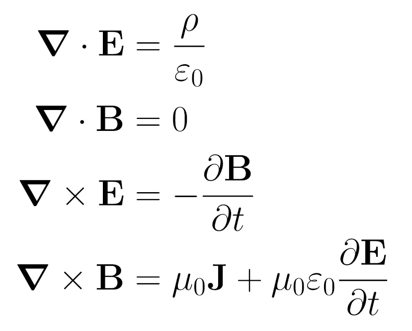
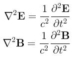

<html lang="es">
<head>
  <meta charset="UTF-8">
  <meta name="viewport" content="width=device-width, initial-scale=1">
  <title>Semana 5 – Ondas: sonido y luz</title>
  
  
  
</head>
<body>
  <!-- NAV -->
  <nav>
    <h2>Temario</h2>
    <ul>
      <li><a href="#ondasMec">Ondas mecánicas</a></li>
      <li><a href="#sonido">Sonido</a></li>
      <li><a href="#ondasElectro">Ondas electromagnéticas</a></li>
      <li><a href="#radiacion">Radiación</a></li>
      <li><a href="#ejercicios">Ejercicios resueltos</a></li>
    </ul>
    

    <h2>Recursos</h2>
    <ul>
      <li><a href="../res/Microcurrículo.pdf">Microcurrículo</a></li>
      <li><a href="https://drive.google.com/drive/folders/1-8WeZK28iaaEToQVGgGCnHxfx8AhXX3f?usp=sharing">Fundamentos físicos de los fenómenos biológicos</a></li>
    </ul>
    <h2>Autores</h2>
    <ul>
      <li><a href="https://www.researchgate.net/profile/Hoover-Pantoja-Sanchez">Hoover Pantoja-Sánchez</a></li>
      <li><a href="https://www.researchgate.net/profile/Marco-Giraldo">Marco A. Giraldo</a></li>
    </ul>
    

    <a href="../" style="color:#1a365d; text-decoration:underline;">&#8592; Volver al cronograma</a>
  </nav>

  <main>
    

    <h1 class="titulo-principal">Semana 5 (Jueves Oct 9)</h1>
    <h1 class="titulo-principal">Ondas: sonido y luz</h1>

    <!-- ============ INTRODUCCIÓN ============ -->
    <section id="generalidades">
      

        
<a href="https://phet.colorado.edu/en/simulations/waves-intro" target="_blank" style="font-weight:bold; color:#2563eb;">🔗 Explora la simulación: Waves Intro (PHET Learning Media)</a>

        
Las ondas, se refieren a perturbaciones que viajan a través del espacio. Estas perturbaciones pueden ocurrir en medios físicos, dando origen a las <strong>ondas mecánicas</strong>, o en campos dando origen a las <strong>ondas electromagnéticas</strong>. Estos dos tipos de ondas son fundamentales para el funcionamiento de los ecosistemas. Los animales, por ejemplo, se comunican a través de vibraciones en el aire, a este fenómeno lo llamamos sonido. A su vez, las plantas usan la luz, una onda electromagnética, en la fotosíntesis. Las vibraciones de la tierra o el sustrato también son usadas por distintas especies animales para interactuar con su entorno. Así, la propagación de ondas se convierte en un fenómeno físico primordial para la naturaleza, que posibilita la vida y sirve de intermediario para distintos componentes fundamentales del comportamiento animal, como la audición o la visión. Por esta razón, las actividades humanas que generan ondas mecánicas o electromagnénticas, son fuentes importantes de impactos sobre la biodiversidad. De aquí la importancia de entender la física de la propagación de ondas, en el contexto de la ecología de zonas costeras.

        

          <strong>Aclaración importante:</strong> en una onda, lo que se propaga es la perturbación. <strong>No hay transporte de materia, aunque sí de energía y momento.</strong> Esto significa que las partículas del medio oscilan alrededor de su posición de equilibrio, pero no se desplazan con la onda. Es la energía la que viaja de un punto a otro.
        

        

          

            <iframe width="420" height="240" src="https://www.youtube.com/embed/-96dxEy1pk8?si=6grk4IONc0idhBxY" title="Qué son las ondas?" frameborder="0" allow="accelerometer; autoplay; clipboard-write; encrypted-media; gyroscope; picture-in-picture; web-share" allowfullscreen></iframe>
            
Video 1. ¿Qué son las ondas?

          

        

        <a href="https://drive.google.com/file/d/1w1WLv_oHjA96jakhlrtE0QjBJ9r1YD3K/view?usp=drive_link" target="_blank" style="display:block;margin:1em 0;font-weight:bold;color:#2563eb;">🎧 Escucha el podcast - Ondas: luz y sonido</a>
      

    </section>

    <!-- ============ ONDAS MECÁNICAS ============ -->
    <section id="ondasMec">
      <h2 class="subtitulo">Ondas Mecánicas</h2>

      

        <strong>Onda mecánica:</strong> perturbación que se propaga a través de un medio material (sólido, líquido o gas). Requiere un medio elástico para transmitirse; no puede propagarse en el vacío. Ejemplos: sonido, ondas sísmicas, ondas en una cuerda.
      

      
En las <strong>ondas mecánicas</strong> la perturbación se propaga por un medio como el aire, una cuerda, un pedazo de madera, el piso o el agua. El sonido, las vibraciones en las cuerdas, las vibraciones en un muelle o las ondas sísmicas — temblores — son ejemplos conocidos de este tipo de ondas. La dirección de propagación y la dirección de perturbación no siempre son la misma. Una <strong>onda transversal</strong> es aquella en la que la dirección de propagación es perpendicular a la dirección de la perturbación. Una <strong>onda longitudinal</strong>, por el contrario, es una onda en la que coinciden la dirección de propagación y la de perturbación. En un fluido — líquido o gas —, las vibraciones solo pueden transmitirse longitudinalmente, pero en un sólido como una cuerda, también se pueden transmitir ondas mecánicas transversales.

      

        

          <iframe src="https://www.youtube.com/embed/JmZkwGR23ek?si=lNEIalEUCV8NUJLh" frameborder="0" title="Tipos de ondas" allowfullscreen></iframe>
          
Video 2. Tipos de ondas.

        

      

      
<a href="https://phet.colorado.edu/en/simulations/wave-on-a-string" target="_blank" style="font-weight:bold; color:#2563eb;">🔗 Explora la simulación: Wave on a String (PHET Learning Media)</a>

      
Cuando una perturbación se propaga en el interior de un fluido líquido o gaseoso las ondas que se generan son longitudinales y se les conoce como sonido. Como se menciona en la introducción, los sonidos son un elemento primordial en la comunicación animal y por lo tanto, a continuación se detallan distintas propiedades de las ondas a partir del análisis del sonido.

    </section>

    <!-- ============ SONIDO ============ -->
    <section id="sonido">
      <h2 class="subtitulo">Sonido</h2>

      

        <strong>Frecuencia (\(f\)):</strong> número de oscilaciones por unidad de tiempo. Se mide en hercios (Hz). El <strong>periodo</strong> es su inverso: \(T = \dfrac{1}{f}\).
      

      

        <strong>Longitud de onda (\(\lambda\)):</strong> distancia entre dos puntos consecutivos que se encuentran en el mismo estado de vibración. Se relaciona con la velocidad y la frecuencia mediante \(\lambda = \dfrac{v}{f}\).
      

      
El sonido consiste en ondas armónicas, es decir, se puede representar a partir de funciones sinusoidales, expresando su intensidad (<strong>y</strong>) a partir del número de onda (<strong>k</strong>) y la frecuencia de la perturbación (<strong>f</strong>). Así, una onda armónica sinusoidal se expresa como:

      \[y(x,t) = A\sin(kx - 2\pi f\, t)\]

      
donde \(A\) se refiere a la amplitud de la onda (<a href="https://www.youtube.com/watch?v=rKf92Vgx2ag&t=504s" style="font-weight:bold;color:#2563eb;">Si quieres entender el origen y profundizar acerca de la interpretación de esta ecuación haz click aquí</a>). La frecuencia \(f\) corresponde al número de oscilaciones por unidad de tiempo y por lo tanto tiene una dimensión \([f]=T^{-1}\) y unidades en el sistema internacional de 1/s, que se denominan Hertzios (Hz) o <em>Hertz</em> en honor al creador del telégrafo y la radio sin cables <a href="https://www.youtube.com/watch?v=XRVsL8cec24" style="font-weight:bold;color:#2563eb;">Heinrich Hertz</a>. De la frecuencia podemos deducir el periodo (\(T\)), que se define como el tiempo que tarda una oscilación:

      \[T = \frac{1}{f}\]

      
De la frecuencia también se puede deducir la longitud de onda (\(\lambda\)), si se conoce la velocidad de propagación (\(v\)) en un medio determinado — la velocidad cambia dependiendo del medio, en el caso del sonido, siendo mayor en el agua (≈ 1500 m/s) que en el aire (≈ 340 m/s). Así, la longitud de onda de un sonido se podría definir como:

      \[\lambda = \frac{v}{f}\]

      

        <strong>Ejemplo: Longitud de onda de un clic de delfín</strong> 
        Un delfín emite clics de ecolocalización con una frecuencia de \(f = 100\,\text{kHz} = 100{,}000\,\text{Hz}\). La velocidad del sonido en el agua es \(v \approx 1500\,\text{m/s}\). ¿Cuál es la longitud de onda?
        \[\lambda = \frac{v}{f} = \frac{1500\,\text{m/s}}{100{,}000\,\text{Hz}} = 0.015\,\text{m} = 1.5\,\text{cm}\]
        La longitud de onda es de apenas 1.5 cm, lo que permite al delfín detectar objetos pequeños con gran precisión.
      

      

        

          <iframe src="https://www.youtube.com/embed/Bbo5xSHE4g4?si=7xoSGQiYb91-jGwZ" title="Características de las ondas" allowfullscreen></iframe>
          
Video 3. Características de las ondas.

        

      

      
<a href="https://phet.colorado.edu/en/simulations/sound-waves" target="_blank" style="font-weight:bold; color:#2563eb;">🔗 Explora la simulación: Sound Waves (PHET Learning Media)</a>

      

        <strong>Intensidad (\(I\)):</strong> energía que atraviesa una unidad de área perpendicular a la dirección de propagación, por unidad de tiempo. Disminuye con el cuadrado de la distancia: \(I \propto \dfrac{1}{r^2}\).
      

      
Como se dijo anteriormente, las ondas no trasladan materia pero propagan una perturbación transmitiendo momento y energía. La energía de la onda surge de la fuente emisora que consume energía y la irradia, en el caso del sonido, con un movimiento armónico. La magnitud física utilizada para caracterizar la energía asociada a una onda es la intensidad (\(I\)), que se refiere a la energía (\(E\)) que atraviesa una unidad de área perpendicular a la dirección de propagación, por unidad de tiempo. A medida que la onda se aleja del emisor, la superficie (\(S\)) del frente de onda aumenta con la distancia (\(r\)) como:

      \[S = 4\pi r^2\]

      
Dado que la superficie aumenta con el cuadrado de la distancia, se deduce que la intensidad se reduce proporcionalmente al cuadrado de la distancia:

      \[I \propto \frac{1}{r^2}\]

      
Para expresar la intensidad del sonido, recurrimos al decibelio de presión sonora (dB SPL), que se define como:

      \[X\,\text{dB SPL} = 20\log\!\left(\frac{p}{p_{\text{ref}}}\right)\]

      
donde \(p\) se refiere a la presión producida por el sonido que se está midiendo y \(p_{\text{ref}}\) corresponde a una presión de referencia estándar de 20 μPa. Para entender a profundidad los decibelios mirar el Video 4.

      

        <strong>Nota:</strong> La escala de decibelios es <strong>logarítmica</strong>. Un aumento de 6 dB corresponde aproximadamente a duplicar la presión sonora, y un aumento de 20 dB significa multiplicar la presión por 10. Esto refleja la forma en que el oído humano percibe la intensidad del sonido.
      

      

        

          <iframe src="https://www.youtube.com/embed/5qtPcGqbxdI?si=MLybQ6KJFXIA2xFH" title="Intensidad del sonido" allowfullscreen></iframe>
          
Video 4. Intensidad del sonido.

        

      

    </section>

    <!-- ============ ONDAS ELECTROMAGNÉTICAS ============ -->
    <section id="ondasElectro">
      <h2 class="subtitulo">Ondas Electromagnéticas</h2>

      

        <strong>Onda electromagnética:</strong> perturbación que se propaga mediante la oscilación acoplada de campos eléctrico y magnético perpendiculares entre sí. No requiere un medio material; puede propagarse en el vacío a la velocidad de la luz \(c \approx 3\times10^8\,\text{m/s}\).
      

      
La definición de las <strong>ondas electromagnéticas</strong> es la culminación de un arduo trabajo de varios científicos del siglo XIX, entre ellos: Gauss, Ørsted, Faraday, Ampère, Oliver Heaviside y sobre todo Maxwell. Estas ondas surgen de la unificación de la teoría electromagnética y por eso, para entenderlas, es necesario abordar la relación entre los fenómenos eléctricos y magnéticos.

      
La electricidad es un fenómeno físico muy conocido desde la antigüedad, dado que se encuentra en distintos fenómenos de la naturaleza, como cuando al frotar una piedra de ámbar, esta es capaz de atraer a pequeños objetos, sin tocarlos. Aunque este fenómeno se conocía desde la antigua Grecia en los años 600 a.C., no es sino hasta el siglo XIX cuando se conceptualiza a partir de la descripción del electrón. Así, en la actualidad entendemos la electricidad como una forma de energía que surge del movimiento de electrones dentro de un material que permite este movimiento. O mejor, <strong>del movimiento de partículas cargadas, en un material conductor</strong>.

      
<a href="https://phet.colorado.edu/es/simulations/balloons-and-static-electricity" target="_blank" style="font-weight:bold; color:#2563eb;">🔗 Explora la simulación: Globos y electricidad estática (PHET Learning Media)</a>

      
<a href="https://phet.colorado.edu/es/simulations/john-travoltage" target="_blank" style="font-weight:bold; color:#2563eb;">🔗 Explora la simulación: Electricidad y estática (PHET Learning Media)</a>

      
El magnetismo también se conoce desde la antigua Grecia. De hecho, su nombre proviene de la región de Magnesia, en donde Tales de Mileto observó una fuerza entre piedras que se encontraban usualmente en la región. La explicación moderna de este fenómeno, también se atribuye a los electrones, o más bien a la orientación de su spin, una propiedad de los electrones. La dirección del spin le da propiedades a los electrones, como si se comportaran como "imanes diminutos". Si un material tiene estos "mini-imanes" orientados, el material se comporta como un macro imán. Por el contrario, si un material, como la madera, tiene los "mini-imanes" desorganizados, el material no muestra propiedades magnéticas. Así, <strong>el magnetismo es un fenómeno físico, producido por la alineación del spin de los electrones — o la dirección de los "mini-imanes" —, que se manifiesta como fuerzas de atracción o repulsión entre objetos</strong>.

      
<a href="https://phet.colorado.edu/es/simulations/magnet-and-compass" target="_blank" style="font-weight:bold; color:#2563eb;">🔗 Explora la simulación: Imán y brújula (PHET Learning Media)</a>

      
La electricidad y el magnetismo no son fenómenos aislados. Están íntimamente interrelacionados.

      

        <ul id="bullets-ondas-electro" style="margin-left: 1.2em;">
          <li>Un flujo de cargas, a lo que llamamos corriente eléctrica, crea magnetismo. Si se hace pasar una corriente eléctrica por una espira, por ejemplo, la corriente eléctrica genera un campo magnético con un polo norte y un polo sur, que depende de la orientación de la corriente. Esta observación ocurrió por error, cuando el físico danés Hans Christian Ørsted observó que una corriente eléctrica modificaba la dirección de una brújula que se encontraba cerca. Con este principio se crean los electroimanes.</li>
        </ul>
        
<a href="https://phet.colorado.edu/es/simulations/magnets-and-electromagnets" target="_blank" style="font-weight:bold; color:#2563eb;">🔗 Explora la simulación: Imanes y Electroimanes (PHET Learning Media)</a>

        <ul style="margin-left: 1.2em;">
          <li>Tras la publicación de Ørsted, Ampère y Faraday demuestran que la variación del campo magnético genera electricidad. De esta manera funcionan los generadores eléctricos.</li>
        </ul>
        
<a href="https://phet.colorado.edu/es/simulations/generator" target="_blank" style="font-weight:bold; color:#2563eb;">🔗 Explora la simulación: Generador eléctrico (PHET Learning Media)</a>

        
<a href="https://phet.colorado.edu/es/simulations/faradays-law" target="_blank" style="font-weight:bold; color:#2563eb;">🔗 Explora la simulación: Ley de Faraday (PHET Learning Media)</a>

      

      
Faraday propone la existencia de <strong>campos, que se comportarían como un fantasma en el espacio generado por un objeto o una carga, que tienen la capacidad de actuar a distancia sobre otros objetos o cargas</strong>. La fuerza eléctrica y magnética se transmiten por medio de estos campos, obedeciendo la ley de Coulomb en el caso de la fuerza eléctrica (\(F\)):

      \[F = k\frac{|q_1 q_2|}{r^2}\]

      
<a href="https://phet.colorado.edu/es/simulations/charges-and-fields" target="_blank" style="font-weight:bold; color:#2563eb;">🔗 Explora la simulación: Cargas y campos (PHET Learning Media)</a>

      
<a href="https://phet.colorado.edu/es/simulations/coulombs-law" target="_blank" style="font-weight:bold; color:#2563eb;">🔗 Explora la simulación: Ley de Coulomb (PHET Learning Media)</a>

      
El escocés James Clerk Maxwell logró unificar matemáticamente la teoría electromagnética, a partir de los descubrimientos anteriores, en 20 ecuaciones que posteriormente Heaviside resumió en 4. Estas 4 leyes se conocen como las <strong>Ecuaciones de Maxwell</strong>:

      

        <strong>Ecuaciones de Maxwell (forma diferencial):</strong>  
        <strong>Ley de Gauss (eléctrica):</strong>
        \[\nabla\cdot\vec{E}=\frac{\rho}{\varepsilon_0}\]
        <strong>Ley de Gauss (magnética):</strong>
        \[\nabla\cdot\vec{B}=0\]
        <strong>Ley de Faraday:</strong>
        \[\nabla\times\vec{E}=-\frac{\partial\vec{B}}{\partial t}\]
        <strong>Ley de Ampère-Maxwell:</strong>
        \[\nabla\times\vec{B}=\mu_0\vec{J}+\mu_0\varepsilon_0\frac{\partial\vec{E}}{\partial t}\]
      

      
Cuando este sistema de ecuaciones se resuelve en el vacío (sin cargas ni corrientes), la solución corresponde a una <strong>ecuación de onda</strong> con una velocidad de propagación igual a la velocidad de la luz:

      \[\nabla^2\vec{E} = \mu_0\varepsilon_0\frac{\partial^2\vec{E}}{\partial t^2}\]

      
Así, Maxwell consiguió unificar la electricidad, el magnetismo y la óptica.

      <figure style="text-align:center; margin:1em 0;">
        

          
        

        

          
        

        <figcaption style="color:#2563eb; font-size:1em; margin-top:0.5em;">Ecuaciones 1. Leyes de Maxwell (panel superior) y ecuaciones de onda (panel inferior).</figcaption>
      </figure>

      

        

          <iframe width="420" height="240" src="https://www.youtube.com/embed/cKKM9boWqZs?si=8q6gnnPYtS38xDtw" title="Ondas electromagnéticas" frameborder="0" allow="accelerometer; autoplay; clipboard-write; encrypted-media; gyroscope; picture-in-picture; web-share" allowfullscreen></iframe>
          
Video 5. Ondas electromagnéticas.

        

      

      

        

          <iframe width="420" height="240" src="https://www.youtube.com/embed/_lrWIogPNFo?si=QrWl8QpTHugh9f6H" title="Claves Ecuaciones de Maxwell" frameborder="0" allow="accelerometer; autoplay; clipboard-write; encrypted-media; gyroscope; picture-in-picture; web-share" allowfullscreen></iframe>
          
Video 7. 6 Claves para entender las Ecuaciones de Maxwell.

        

        

          <iframe width="420" height="240" src="https://www.youtube.com/embed/Y-XbsWEjyp0?si=EHHRtpbscwMoK3Ah" title="Ecuaciones de Maxwell, historia" frameborder="0" allow="accelerometer; autoplay; clipboard-write; encrypted-media; gyroscope; picture-in-picture; web-share" allowfullscreen></iframe>
          
Video 6. Ecuaciones de Maxwell, historia del electromagnetismo.

        

      

    </section>

    <!-- ============ RADIACIÓN ============ -->
    <section id="radiacion">
      <h2 class="subtitulo">Radiación</h2>

      
Las ondas electromagnéticas abarcan un amplio rango de frecuencias y longitudes de onda conocido como el <strong>espectro electromagnético</strong>. Desde las ondas de radio de baja frecuencia hasta los rayos gamma de altísima energía, todas son manifestaciones del mismo fenómeno físico descrito por las ecuaciones de Maxwell.

      

        <strong>Espectro electromagnético:</strong> El espectro se organiza por longitud de onda (o frecuencia) y comprende, de menor a mayor energía: <strong>ondas de radio</strong> → <strong>microondas</strong> → <strong>infrarrojo (IR)</strong> → <strong>luz visible</strong> (400–700 nm) → <strong>ultravioleta (UV)</strong> → <strong>rayos X</strong> → <strong>rayos gamma (γ)</strong>. La luz visible constituye una fracción muy pequeña del espectro total, pero es la que los organismos han aprovechado evolutivamente para la visión y la fotosíntesis.
      

      <table>
        <thead>
          <tr>
            <th>Tipo de radiación</th>
            <th>Longitud de onda</th>
            <th>Frecuencia aproximada</th>
            <th>Relevancia biológica</th>
          </tr>
        </thead>
        <tbody>
          <tr><td>Ondas de radio</td><td>&gt; 1 m</td><td>&lt; 300 MHz</td><td>Comunicaciones; baja interacción biológica</td></tr>
          <tr><td>Microondas</td><td>1 mm – 1 m</td><td>300 MHz – 300 GHz</td><td>Calentamiento de tejidos (horno microondas)</td></tr>
          <tr><td>Infrarrojo (IR)</td><td>700 nm – 1 mm</td><td>300 GHz – 430 THz</td><td>Radiación térmica; detección infrarroja en serpientes</td></tr>
          <tr><td>Luz visible</td><td>400 – 700 nm</td><td>430 – 750 THz</td><td>Fotosíntesis (400–700 nm); visión animal</td></tr>
          <tr><td>Ultravioleta (UV)</td><td>10 – 400 nm</td><td>750 THz – 30 PHz</td><td>Síntesis de vitamina D; daño al ADN</td></tr>
          <tr><td>Rayos X</td><td>0.01 – 10 nm</td><td>30 PHz – 30 EHz</td><td>Diagnóstico médico; riesgo de mutaciones</td></tr>
          <tr><td>Rayos gamma (γ)</td><td>&lt; 0.01 nm</td><td>&gt; 30 EHz</td><td>Radioterapia; esterilización</td></tr>
        </tbody>
      </table>

      
La energía de cada fotón — la unidad mínima de radiación electromagnética — está directamente relacionada con su frecuencia mediante la ecuación de Planck:

      \[E = hf = \frac{hc}{\lambda}\]

      
donde \(h = 6.626\times10^{-34}\,\text{J·s}\) es la constante de Planck y \(c = 3\times10^8\,\text{m/s}\) la velocidad de la luz. Esto implica que a mayor frecuencia (menor longitud de onda), mayor es la energía del fotón, lo que explica por qué la radiación UV, los rayos X y los rayos gamma son potencialmente dañinos para los seres vivos.

      <h3 class="subtitulo2">Relevancia biológica de la radiación</h3>

      
<strong>Fotosíntesis:</strong> las plantas absorben fotones en el rango visible (400–700 nm), especialmente en las bandas azul (~450 nm) y roja (~680 nm), convirtiendo la energía luminosa en energía química. Este rango se conoce como <strong>radiación fotosintéticamente activa (PAR)</strong>.

      
<strong>Daño al ADN por UV:</strong> la radiación ultravioleta, especialmente la UV-B (280–315 nm) y UV-C (&lt; 280 nm), tiene suficiente energía para romper enlaces en las moléculas de ADN, produciendo dímeros de pirimidina. Estos daños pueden conducir a mutaciones y, en organismos multicelulares, a cáncer. La capa de ozono filtra gran parte de la UV-C y UV-B, protegiendo la biosfera.

      
<strong>Visión animal:</strong> diferentes especies han evolucionado fotorreceptores sensibles a distintas regiones del espectro. Muchos insectos y aves perciben la radiación UV, mientras que algunas serpientes detectan el infrarrojo. La visión humana se limita al rango 400–700 nm.

      

        

          <iframe width="420" height="240" src="https://www.youtube.com/embed/jzYXFcDcmFg?si=IzPkJWx6_p16DCwI" title="Radiación" frameborder="0" allow="accelerometer; autoplay; clipboard-write; encrypted-media; gyroscope; picture-in-picture; web-share" allowfullscreen></iframe>
          
Video 8. ¿Qué es la radiación? ☢

        

      

      
<a href="https://phet.colorado.edu/en/simulations/models-of-the-hydrogen-atom" target="_blank" style="font-weight:bold; color:#2563eb;">🔗 Explora la simulación: Models of the Hydrogen Atom (PHET Learning Media)</a>

      

        

          <iframe width="420" height="240" src="https://www.youtube.com/embed/82XVKoU1M5g?si=jZYzoNnjAUOWxAt3" title="Cómo ven los animales" frameborder="0" allow="accelerometer; autoplay; clipboard-write; encrypted-media; gyroscope; picture-in-picture; web-share" allowfullscreen></iframe>
          
Video 9. ¿Cómo ven los animales?

        

      

      
<a href="https://phet.colorado.edu/en/simulations/color-vision" target="_blank" style="font-weight:bold; color:#2563eb;">🔗 Explora la simulación: Color Vision (PHET Learning Media)</a>

      

        

          <iframe width="420" height="240" src="https://www.youtube.com/embed/0Fh2Nw_W_UU?si=UTroKZXdjHHKnfXu" title="Marie Curie" frameborder="0" allow="accelerometer; autoplay; clipboard-write; encrypted-media; gyroscope; picture-in-picture; web-share" allowfullscreen></iframe>
          
Video 10. Biografías científicas - Marie Curie, una mujer sin barreras.

        

      

    </section>

    <!-- ============ EJERCICIOS RESUELTOS ============ -->
    <section id="ejercicios">
      <h2 class="subtitulo">Ejercicios Resueltos</h2>

      <!-- Ejercicio 1 -->
      <h3 class="subtitulo2">Ejercicio 1: Nivel de presión sonora</h3>

      

        <strong>Enunciado:</strong> Una ballena jorobada produce un canto con un nivel de presión sonora de 180 dB SPL medido a 1 m de distancia. ¿Cuál será el nivel de presión sonora a 100 m de distancia?
      

      
<strong>Datos:</strong>

      <ul style="line-height:1.7;">
        <li>Nivel a distancia \(r_1 = 1\,\text{m}\): \(\text{dB}_1 = 180\,\text{dB SPL}\)</li>
        <li>Distancia de interés: \(r_2 = 100\,\text{m}\)</li>
      </ul>

      
<strong>Desarrollo:</strong>

      
Sabemos que la intensidad del sonido disminuye con el cuadrado de la distancia: \(I \propto 1/r^2\). Para convertir este decaimiento a la escala de decibelios, usamos la relación:

      \[\text{dB}_2 = \text{dB}_1 - 20\log\!\left(\frac{r_2}{r_1}\right)\]

      
Sustituyendo los valores:

      \[\text{dB}_2 = 180 - 20\log\!\left(\frac{100}{1}\right) = 180 - 20\log(100)\]

      
Dado que \(\log(100) = 2\):

      \[\text{dB}_2 = 180 - 20 \times 2 = 180 - 40 = 140\,\text{dB SPL}\]

      

        <strong>Resultado:</strong> A 100 m de la ballena, el nivel de presión sonora es de <strong>140 dB SPL</strong>, que sigue siendo extremadamente intenso (comparable al umbral de dolor en humanos). Esto explica por qué la contaminación acústica submarina afecta gravemente a los cetáceos.
      

      <!-- Ejercicio 2 -->
      <h3 class="subtitulo2">Ejercicio 2: Energía de un fotón</h3>

      

        <strong>Enunciado:</strong> Calcule la energía de un fotón de luz verde con longitud de onda \(\lambda = 520\,\text{nm}\). Exprésela en electronvoltios (eV). Luego, compare con la energía de un fotón UV con \(\lambda = 280\,\text{nm}\) y discuta su relevancia para el daño al ADN.
      

      
<strong>Datos y constantes:</strong>

      <ul style="line-height:1.7;">
        <li>\(h = 6.626\times10^{-34}\,\text{J·s}\)</li>
        <li>\(c = 3\times10^{8}\,\text{m/s}\)</li>
        <li>\(1\,\text{eV} = 1.602\times10^{-19}\,\text{J}\)</li>
      </ul>

      
<strong>Parte A — Fotón verde (\(\lambda = 520\,\text{nm}\)):</strong>

      \[E = \frac{hc}{\lambda} = \frac{6.626\times10^{-34} \times 3\times10^{8}}{520\times10^{-9}}\]

      \[E = \frac{1.988\times10^{-25}}{5.20\times10^{-7}} = 3.823\times10^{-19}\,\text{J}\]

      
Convirtiendo a electronvoltios:

      \[E = \frac{3.823\times10^{-19}}{1.602\times10^{-19}} \approx 2.39\,\text{eV}\]

      
<strong>Parte B — Fotón UV (\(\lambda = 280\,\text{nm}\)):</strong>

      \[E_{UV} = \frac{hc}{\lambda} = \frac{1.988\times10^{-25}}{280\times10^{-9}} = 7.10\times10^{-19}\,\text{J} \approx 4.43\,\text{eV}\]

      

        <strong>Resultado y discusión:</strong>
        <ul>
          <li>Fotón verde (520 nm): \(E \approx 2.39\,\text{eV}\)</li>
          <li>Fotón UV (280 nm): \(E \approx 4.43\,\text{eV}\)</li>
        </ul>
        El fotón UV tiene casi el doble de energía que el fotón verde. La energía necesaria para romper un enlace covalente en el ADN (por ejemplo, para formar dímeros de timina) es de aproximadamente 3.5–4.5 eV. El fotón de luz visible <strong>no</strong> alcanza esta energía, por lo que no daña el ADN, mientras que el fotón UV-B (280 nm) <strong>sí</strong> tiene suficiente energía para causar lesiones, lo que explica el riesgo de mutaciones y cáncer de piel por exposición prolongada a la radiación ultravioleta.
      

    </section>

    
<!-- .container -->
  </main>
</body>
</html>
