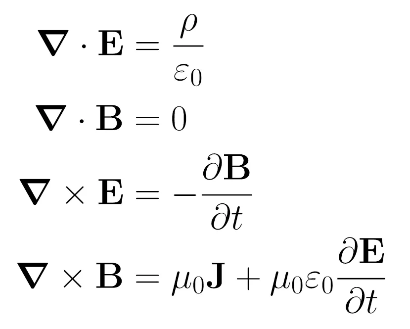
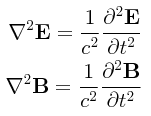

<html lang="es">
<head>
  <meta charset="UTF-8">
  <title>Semana 5 - Jueves Octubre 9</title>
  
</head>
<body style="display: flex; margin: 0; min-height: 100vh;">
  <nav style="width: 240px; background: #f4f4f4; padding: 2em 1.2em 2em 1.2em; min-height: 100vh; box-shadow: 2px 0 8px #e0e7ef; border-right: 1px solid #e0e7ef; position: fixed; top: 0; left: 0; height: 100vh; overflow-y: auto; z-index: 1000;">
    <h2 style="font-size: 1.2em; color: #1a365d; margin-top: 0; margin-bottom: 1.2em; letter-spacing: 0.5px;">Temario</h2>
    <ul style="list-style: none; padding: 0; margin-bottom: 1.5em;">
      <li><a href="#temperatura">Temperatura, calor y trabajo</a></li>
      <li><a href="#principios">Principios de la termodinámica</a></li>
      <li><a href="#transiciones">Transiciones de fase</a></li>
    </ul>
    

    <h2 style="font-size: 1.2em; color: #1a365d; margin-top: 0; margin-bottom: 1.2em; letter-spacing: 0.5px;">Recursos</h2>
    <ul style="list-style: none; padding: 0; margin-bottom: 1.5em;">
      <li><a href="../res/Microcurrículo.pdf"> Microcurrículo</a></li>
      <li><a href="https://drive.google.com/drive/folders/1-8WeZK28iaaEToQVGgGCnHxfx8AhXX3f?usp=sharing"> Fundamentos físicos de los fenómenos biológicos</a></li>
    </ul>
    <h2 style="font-size: 1.2em; color: #1a365d; margin-top: 0; margin-bottom: 1.2em; letter-spacing: 0.5px;">Autores</h2>
    <ul style="list-style: none; padding: 0; margin-bottom: 1.5em;">
      <li><a href="https://www.researchgate.net/profile/Hoover-Pantoja-Sanchez">Hoover Pantoja-Sánchez</a></li>
      <li><a href="https://www.researchgate.net/profile/Marco-Giraldo">Marco A.Giraldo</a></li>
    </ul>
    

    <a href="../" style="font-size:1em; color:#1a365d; background:none; border:none; text-decoration:underline;">&#8592; Volver al cronograma</a>
  </nav>
  <main style="flex: 1; padding: 2.5em 3em; background: #fff; min-height: 100vh; margin-left: 240px;">
    <h1 class="titulo-principal">Semana 7 (Jueves Oct 30)</h1>
    <section id="generalidades">
      <h1 class="titulo-principal">Termodinámica</h1>
      

        

          <iframe width="420" height="240" src="https://www.youtube.com/embed/ZLAoKBVglU8?si=ie_N6MbjElBdsYK0" title="Explicación sencilla y un poco de historia" frameborder="0" allow="accelerometer; autoplay; clipboard-write; encrypted-media; gyroscope; picture-in-picture; web-share" allowfullscreen></iframe>
          
Video 1. Explicación sencilla y un poco de historia.

        

      

      

        
Se enfoca en sistemas compuestos por elevados números de partículas, átomos o moléculas. Del orden del número de Avogadro, que es aproximadamente 6.02x1023
 
        
<a href="https://phet.colorado.edu/en/simulations/energy-forms-and-changes" target="_blank" style="font-weight:bold; color:#2563eb; ">🔗 Explora la simulación: Energy Forms and Changes (PBS Learning Media)</a>

        <a href="https://drive.google.com/file/d/1VTUUN-J4ZzfDO-ab1MGtAmoCuag7V1cD/view?usp=sharing" target="_blank" style="display:block;margin:1em 0;font-weight:bold;color:#2563eb;">🎧 Escucha el podcast - Termodinámica y Vida </a>
      

      

        

          <iframe width="420" height="240" src="https://www.youtube.com/embed/UoQqglMVW1g?si=AH2hoZ0CVpOx0ld2" title="Qué son las ondas?" frameborder="0" allow="accelerometer; autoplay; clipboard-write; encrypted-media; gyroscope; picture-in-picture; web-share" allowfullscreen></iframe>
          
Video 2. ¿De donde viene el número de Avogadro?

        

        

        <iframe width="420" height="240" src="https://www.youtube.com/embed/92QHLRt1Bv0?si=42oP-E_tfW0PJqj-" title="Ecuaciones de Maxwell, historia" frameborder="0" allow="accelerometer; autoplay; clipboard-write; encrypted-media; gyroscope; picture-in-picture; web-share" allowfullscreen></iframe>
        
Video 3. Gases ideales, historia del electromagnetismo.

        

      

    </section>
    <section id="temperatura">
    <h2 class="subtitulo">Temperatura Calor y Trabajo</h2>
        

        

          

            <iframe src="https://www.youtube.com/embed/JmZkwGR23ek?si=lNEIalEUCV8NUJLh" frameborder="0" title="Video Leyes de Newton 1" allowfullscreen style="width:100%; height:200px; border:none; border-radius:8px; margin-bottom:0.5em;"></iframe>
            
Video 2. Tipos de ondas.

          

        

        
<a href="https://phet.colorado.edu/en/simulations/wave-on-a-string" target="_blank" style="font-weight:bold; color:#2563eb; ">🔗 Explora la simulación: Wave on a String (PHET Learning Media)</a>

        

     </section>
     <section id="principios">
     <h2 class="subtitulo">Principios de la termodinámica</h2>
        

        
<a href="https://phet.colorado.edu/en/simulations/sound-waves" target="_blank" style="font-weight:bold; color:#2563eb; ">🔗 Explora la simulación: Sound Waves (PHET Learning Media)</a>

        
 <strong>I ∝ 1/r2</strong>.

        

        

          

            <iframe src="https://www.youtube.com/embed/5qtPcGqbxdI?si=MLybQ6KJFXIA2xFH" title="Video Fuerzas en biomecánica" allowfullscreen style="width:100%; height:200px; border:none; border-radius:8px; margin-bottom:0.5em;"></iframe>
            
Video 4. Intensidad del sonido.

          

        

    </section>
    <section id="transiciones">
    <h2 class="subtitulo">Transiciones de fase</h2>
      

      
<a href="https://phet.colorado.edu/es/simulations/balloons-and-static-electricity" target="_blank" style="font-weight:bold; color:#2563eb; ">🔗 Explora la simulación: Globos y electricidad estática (PHTE Learning Media)</a>

      
<a href="https://phet.colorado.edu/es/simulations/john-travoltage" target="_blank" style="font-weight:bold; color:#2563eb; ">🔗 Explora la simulación: Electricidad y estática (PHTE Learning Media)</a>

      

      
<a href="https://phet.colorado.edu/es/simulations/magnet-and-compass" target="_blank" style="font-weight:bold; color:#2563eb; ">🔗 Explora la simulación: Iman y brújula (PHTE Learning Media)</a>

      
</strong>.

      <!-- Espacio para bulletpoints -->
      

        <ul id="bullets-ondas-electro" style="margin-left: 1.2em;">
          <li></li>
          
<a href="https://phet.colorado.edu/es/simulations/magnets-and-electromagnets" target="_blank" style="font-weight:bold; color:#2563eb; ">🔗 Explora la simulación: Imanes y Electroimanes (PHTE Learning Media)</a>

          <li> </li>
          
<a href="https://phet.colorado.edu/es/simulations/generator" target="_blank" style="font-weight:bold; color:#2563eb; ">🔗 Explora la simulación: Generador eléctrico (PHTE Learning Media)</a>

          
<a href="https://phet.colorado.edu/es/simulations/faradays-law" target="_blank" style="font-weight:bold; color:#2563eb; ">🔗 Explora la simulación: Ley de Faraday (PHTE Learning Media)</a>

        </ul>
      

      
<strong>F=k.|q1.q2|/r2</strong>.

      
<a href="https://phet.colorado.edu/es/simulations/charges-and-fields" target="_blank" style="font-weight:bold; color:#2563eb; ">🔗 Explora la simulación: Cargas y campos (PHTE Learning Media)</a>

      
<a href="https://phet.colorado.edu/es/simulations/coulombs-law" target="_blank" style="font-weight:bold; color:#2563eb; ">🔗 Explora la simulación: Ley de Coulomb (PHTE Learning Media)</a>

      
El escoses James Cleark Maxwell, logró unificar matemáticamente la teoría electromagnética, a partir de los descubrimientos anteriores, en 20 ecuaciones que posteriormente Heaviside resumió en 4 (Ecuaciones 1). Estas 4 leyes se conocen como las Leyes de Maxwell y cuando este sistema de ecuaciones se resuelve, la solución corresponde a una onda longitudinal con una velocidad de propagación igual a la velocidad de la luz (Ecuaciones 1). Así, Maxwell consiguió unificar la electricidad, el magnetismo y la óptica.

      <figure style="text-align:center; margin:1em 0;">
      

        
      

      

        
      

      <figcaption style="color:#2563eb; font-size:1em; margin-top:0.5em;">Ecuaciones 1. Leyes de Maxwell (panel superior) y ecuaciones de onda (panel inferior).</figcaption>
    </figure>
      

        

            <iframe width="420" height="240" src="https://www.youtube.com/embed/cKKM9boWqZs?si=8q6gnnPYtS38xDtw" title="Qué son las ondas?" frameborder="0" allow="accelerometer; autoplay; clipboard-write; encrypted-media; gyroscope; picture-in-picture; web-share" allowfullscreen></iframe>
            
Video 5. Ondas electromagnéticas?.

        

      

      

        

          <iframe width="420" height="240" src="https://www.youtube.com/embed/_lrWIogPNFo?si=QrWl8QpTHugh9f6H" title="Qué son las ondas?" frameborder="0" allow="accelerometer; autoplay; clipboard-write; encrypted-media; gyroscope; picture-in-picture; web-share" allowfullscreen></iframe>
          
Video 7. 6 Claves para entender las Ecuaciones de Maxwell.

        

        

        <iframe width="420" height="240" src="https://www.youtube.com/embed/Y-XbsWEjyp0?si=EHHRtpbscwMoK3Ah" title="Ecuaciones de Maxwell, historia" frameborder="0" allow="accelerometer; autoplay; clipboard-write; encrypted-media; gyroscope; picture-in-picture; web-share" allowfullscreen></iframe>
        
Video 6. Ecuaciones de Maxwell, historia del electromagnetismo.

        

      

    </section>
    <section id="Radiación">
    <h2 class="subtitulo">Radiación</h2>
      

        

          <iframe width="420" height="240" src="https://www.youtube.com/embed/jzYXFcDcmFg?si=IzPkJWx6_p16DCwI" title="YouTube video player" title="Radiación" frameborder="0" allow="accelerometer; autoplay; clipboard-write; encrypted-media; gyroscope; picture-in-picture; web-share" allowfullscreen></iframe>
          
Video 8. ¿Qué es la radiación? ☢.

        

      

      
<a href="https://phet.colorado.edu/en/simulations/models-of-the-hydrogen-atom" target="_blank" style="font-weight:bold; color:#2563eb; ">🔗 Explora la simulación: Models of the Hydrogen Atom (PHTE Learning Media)</a>

      

        

          <iframe width="420" height="240" src="https://www.youtube.com/embed/82XVKoU1M5g?si=jZYzoNnjAUOWxAt3" title="Qué son las ondas?" frameborder="0" allow="accelerometer; autoplay; clipboard-write; encrypted-media; gyroscope; picture-in-picture; web-share" allowfullscreen></iframe>
          
Video 9. ¿Cómo ven los animales?.

        

      

      
<a href="https://phet.colorado.edu/en/simulations/color-vision" target="_blank" style="font-weight:bold; color:#2563eb; ">🔗 Explora la simulación: Color Vision (PHTE Learning Media)</a>

      

        

          <iframe width="420" height="240" src="https://www.youtube.com/embed/0Fh2Nw_W_UU?si=UTroKZXdjHHKnfXu" title="Marie Curie" frameborder="0" allow="accelerometer; autoplay; clipboard-write; encrypted-media; gyroscope; picture-in-picture; web-share" allowfullscreen></iframe>
          
Video 10. Biografías científicas - Marie Curie, una mujer sin barreras.

        

      

    </section>
  </main>
</body>
</html>
